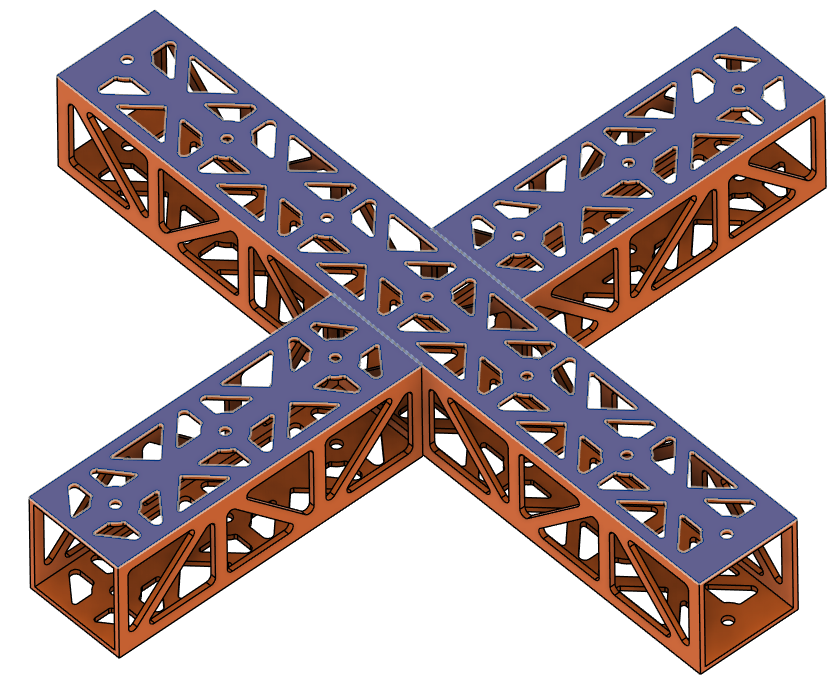
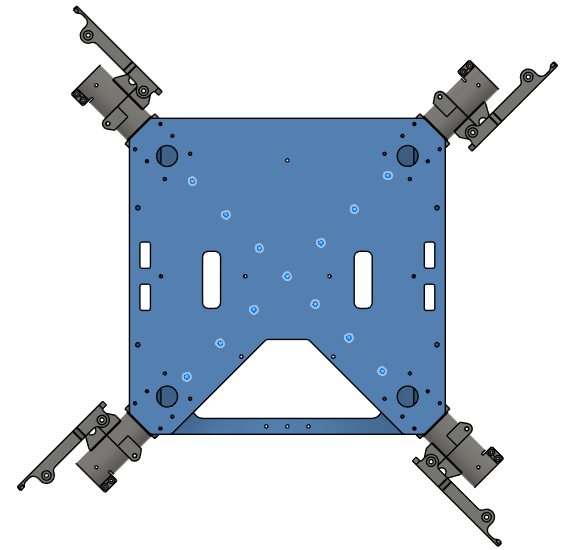
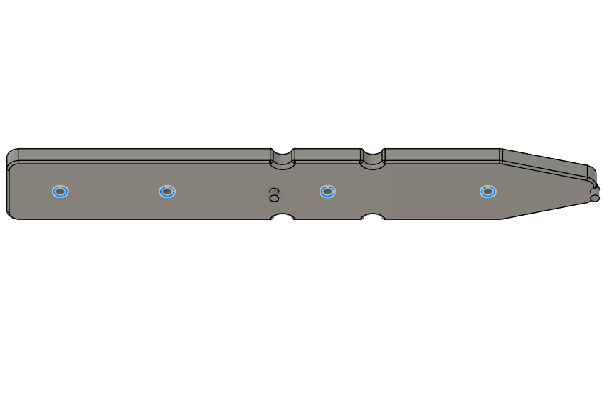
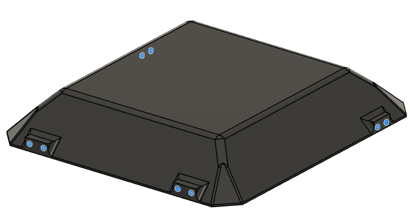

# **Project Quiver PT3 Structural Assembly Guide**

## BOM for the assembly

Table 1: Structure parts and additional material

| Part Nr. | Structure Part                                                                                                      | CAD ID  | Material | Sourcing | Quantity |
| -------- | ------------------------------------------------------------------------------------------------------------------- | -------- | -------- | -------- | -------- |
| 1        | Upper plate 2mm aluminum                                                                                            |1101 | | | 1        |
| 2        | Middle plate 2mm aluminum                                                                                           |1102 | |  | 1        |
| 3        | Cockpit Support Beam 40x40x2 mm aluminum (length: 124 mm)                                                                 |1212 & 1213 | | | 2        |
| 4        | Small square tube 40x40x2 mm aluminum (length: 289 mm)                                                                 | | | | 1        |
| 5        | Side rectangle 30x100x2 mm aluminum (length: 300 mm)                                                                   | | | | 2        |
| 6        | Lower plate 4mm aluminum                                                                                       | | | | 1        |
| 7        | Folding arm adapter                                                                                                 | | | | 4        |
| 8        | CF motor beam (length: 360mm)                                                                                       | | | | 4        |
| 9        | CF landing leg beam (length: 400mm)                                                                                 | | | | 4        |
| 10       | CF landing leg bottom beam (length: 500mm)                                                                          | | | | 2        |
| 11       | Landing leg adapter top (aluminum)                                                                                  | | | | 4        |
| 12       | Landing leg adapter bottom (printed)                                                                                | | | | 4        |
| 13       | Battery slider                                                                                                      | | | | 2        |
| 14       | Rivet 1 (4mm Dia. for 2.5mm-4.5mm thickness; McMaster Part: [97525A251](https://www.mcmaster.com/97525A251))        | | | | 36       |
| 15       | Rivet 2 (4mm Dia- for 4.5mm-6.4mm thickness; McMaster Part: [97525A226](https://www.mcmaster.com/97525A226))        | | | | 10       |
| 16       | Screw 1 (Hex Drive Flat Head Screw M3x8, McMaster Part: [**92125A128**](https://www.mcmaster.com/92125A128)**)**    | | | | 48       |
| 17       | Screw 2 (Flanged Button Head Screw M4x10; McMaster Part: [97654A373](https://www.mcmaster.com/97654A373))           | | | | 24       |
| 18       | Screw 3 (Socket Head Screw M3x16; McMaster Part: [91292A115](https://www.mcmaster.com/91292A115))                   | | | | 24       |
| 19       | Washer 1 (General Purpose Washer 3.2mm ID, 6mm OD; McMaster Part: [98689A112](https://www.mcmaster.com/98689A112/)) | | | | 24       |
| 20       | Nut 1 (Nylon-Insert Locknut M3; McMaster Part: [**90576A811**](https://www.mcmaster.com/90576A811/)**)**            | | | | 24       |

## Preparation

### Parts 1-3
- All three are aluminum 6 series sheets, laser cut, sanded. 
- Bounding box dimension is 300x300x2 mm for each.

| | Part 1 (Upper Plate) | Part 2 (Mid Plate) | Part 3 (Lower Plate)|
|--|--|--|--|
|Thickness|2 mm|2 mm|4 mm|
| Image|  |  |  |  
| CAD File|[Part 1](assets/models/part1.step)| [Part 2](assets/models/part2.step)| [Part 3](assets/models/part3.step)|

### Parts 4-6
- All three are aluminum 6 series, 40x40x2 mm square tubes, laser cut, sanded. 
- Part 5 and Part 6 are identical, order 2 parts for the same geometry.

| | Part 4 (Cockpit Support Beam CW Long) | Part 5 & 6 (Cockpit Support Beam CCW Back & Front) |
|--|--|--|
|Length|289.2 mm|124.2 mm|
| Image|  |  |
| CAD File|[Part 4](assets/models/part4.step)| [Part 5 & 6](assets/models/part5_6.step)|

## Parts 7-8
- Both are aluminum 6 series, 1000x30x2 mm rectangular tubes, laser cut, sanded.
- Length is 300 mm for each.
- Parts are identical, order 2 parts of the same geometry.

| | Part 7 & 8 (Battery Wall Left & Right) |
|--|--|
| Image|  |
| CAD File|[Part 7 & 8](assets/models/part7_8.step)|

## Part 9
- Off-the-shelf component.
- 30 mm option.
- 4 parts in total.
- Product Link: [Link](https://www.alibaba.com/product-detail/30-40mm-Folding-arm-tube-Drone_1600762096177.html?spm=a2756.order-detail-ta-bn-b.0.0.78e1f19cegXkOZ)

## Parts 10-12
- 30x2 mm circular carbon-fiber tubes with different lenghts.
- Reference link: [Link](https://www.rjxhobby.com/carbon-fiber/carbon-fiber-tube/rjx-1pcs-colored-3k-carbon-fiber-tube-1000mm-od-21-30mm)
  - Order 5 x 1000 mm or 10 x 500 mm

| | Part 10 (Motor Arms) | Part 11 (Landing Leg Vertical Tubes) | Part 12 (Landing Leg Horizontal Tubes) |
|--|--|--|--|
|Length|360 mm| 400 mm| 500 mm|
|Quantity|4|4|2|

## Part 13
- Off-the-shelf component.
- 30 mm option.
- 4 parts in total.
- Product Link: [Link](https://www.alibaba.com/product-detail/20mm-25mm-30mm-pipe-diameter-fixed_1601140918673.html?spm=a2756.trade-carp.valid-supplier.7.13873192MoJgE3)

## Part 14
- Off-the-shelf component.
- Part Number: GN 237-ZD-30-30-A-SW
- 2 parts in total.
- Product Link: [Link](https://www.jwwinco.com/en-us/products/3.3-Hinging-latching-locking-of-doors-and-covers/Hinges/GN-237-Zinc-Die-Cast-or-Aluminum-Hinges-Countersunk-Thru-Holes-or-Threaded-Stud-Type)

## Parts 15-23
- All 3D printed parts.
- They have structural roles on the airframe. Use **PETG-CF** filament.
- STL link: [Parts 15-23](assets/models/parts15_23.zip)

|Part|Quantity|
|--|--|
|Part 15| 4 |
|Part 16| 2 |
|Part 17| 1 |
|Part 18| 1 |
|Part 19| 4 |
|Part 20| 1 |
|Part 21| 1 |
|Part 22| 1 |
|Part 23| 1 |

## Parts 24-29
- All 3D printed parts.
- The parts should not interfere with GNSS signals. Use **PETG** filament.
- **DO NOT** use any filament containing carbon fiber.
- STL link: [Parts 24-29](assets/models/parts24_29.zip)

|Part|Quantity|
|--|--|
|Part 24| 1 |
|Part 25| 1 |
|Part 26| 1 |
|Part 27| 1 |
|Part 28| 1 |
|Part 29| 4 |

## Part 31
- Off-the-shelf component.
- Order without PCB.
- 3 parts in total.
- Product Link: [Link](https://www.alibaba.com/product-detail/Quick-Release-Clip-Plate-Clamp-Quick_1600982145247.html?chatToken=dTVOQ0lHSDBGNnNIYWVkZGdQNnBUSmFhUzNnb3dTTktRdTFiYjZVZzJRb25RRjBPTUs0bVZqdUd5MHUvYWVCblk4R2ZnVHdnREZwTWh3bjZ6bTJmRXYwWXdUVm1sOUd3Sk5YaVRGVWpCK2h4MXlSRkhRcHk0cWI4US9VUDI5R0kmdmVyc2lvbj0xLjAuMA%3D%3D&encryptTargetLoginId=8pctgRBMALNqZAuqE6c17aH4RKPxocV0)

## Tool List

- You need the following tools:
  - Allen key set
  - Wrench set
  - Cordless screwdriver or drill press
  - Riveting tool
  - Loctite Threadlocker Blue 242
  - Adhesive: Loctite Superflex Silicon Sealant Model 593, 6.4 fl. oz.
  - A cleaning agent to prepare 
- Check if all the necessary parts are there

# Assembly Steps

## Step 1. Assemble the Cockpit Support Beams on Mid Plate
- Parts needed:
  - Part 2 (Mid Plate)
  - Parts 4, 5, 6 (Cockpit Support Beams)
  - Rivet 1 x13

- Place the cockpit support beams on the mid plate as shown to the picture.
- Apply adhesive on the cockpit support beams around the holes on the contact side.
- Rivet the cockpit support beams from the mid plate on the holes shown in the picture.
  - Make sure you rivet before the adhesive dries.

|Orientation|Adhesive Area|Rivet Holes|
|--|--|--|
||  |  |

## Step 2. Install the Battery Walls
- Parts needed:
  - Step 1 chassis
  - Parts 7, 8 (Battery Walls)
  - Rivet 2 x10
- Place the battery walls on the sides of the chassis as shown in the picture.
  - Make sure the dented side stays on the chassis side.
- Rivet the battery walls from the mid plate on the holes shown in the picture.
  - Make sure you rivet before the adhesive dries.

|Orientation|Adhesive Area|Rivet Holes|
|--|--|--|
||  |  |

## Step 3. Install the Motor Arm Connectors
- Parts needed:
  - Step 2 chassis
  - Part 9 x4 (Foldable Motor Arm Connectors)
  - Screw 1 x16
  - Screw 4 x8
  - Washer 1 x24
- Place the motor arm connectors on the chassis as shown in the picture.
- Secure the motor arm connectors on the chassis.
  - Use **Screw 1** for **red holes** and **Screw 4** for **green holes**.
  - Use Loctite Threadlocker.
  - Use Washer 1.
  - Use cordless screwdriver where possible, or else an allen key.
 
|Orientation|Screw Holes|
|--|--|
||  |

## Step 4. Install the Lower Plate
- Parts needed:
  - Step 3 chassis
  - Part 3 (Lower Plate)
  - Rivet 2 x10
- Place the lower plate on the chassis as shown to the picture.
- Apply adhesive on the battery walls around the holes on the contact side.
- Rivet the lower plate to the chassis on the holes shown in the picture.
  - Make sure you rivet before the adhesive dries.

|Orientation|Adhesive Area|Rivet Holes|
|--|--|--|
||  |  |

## Step 5. Install the Upper Plate
- Parts needed:
  - Step 4 chassis
  - Rivet 1 x13
  - Screw 1 x24
  - Washer 1 x24

- Place the upper plate over the chassis as shown to the picture.
- Apply adhesive on the cockpit support beams around the holes on the contact side.
- Rivet the cockpit support beams from the upper plate on the holes shown in the picture.
  - Make sure you rivet before the adhesive dries.
- Screw the motor arm connecters from the upper plate with Screw 1.
  - Use Washer 1.
  - Use Loctite Threadlocker.

|Orientation|Adhesive Area|Rivet Holes|
|--|--|--|
||  |  |
- 
  - Rivet 2 x10

## Step 6. Install the Battery Connector PCB Mount
- Parts needed:
  - Step 5 chassis
  - Part 26 (Main PCB Mount)
  - Insert 1 x20
  - Screw 5 x20
  - Washer 1 x20

- Place Insert 1 to the holes shown in the picture, on the top and bottom sides of the main PCB mount.
  - Use a soldering iron to place them inside the plastic.

|Top|Bottom|
|--|--|
||  |

- Place the main PCB mount over the upper plate.
  - Secure it with 5x Screw 5 in total from below the upper plate on the holes below.
  - Use Washer 1 for the holes.

## Step 7. Install the Main PCB Mount
- Parts needed:
  - Step 6 chassis
  - Part 30 (BC PCB Mount)
  - Insert 1 x10
  - Screw 5 x3
  - Washer 1 x3

- Place Insert 1 to the holes shown in the picture, on the top and bottom sides of the BC PCB mount.
  - Use a soldering iron to place them inside the plastic.

|Top|Bottom|
|--|--|
||  |

- Place the Battery Connector PCB mount over the mid plate.
  - Secure it with 3x Screw 5 in total from below the mid plate on the holes below.
  - Use Washer 1 for the holes.

## Step 8. Install the Battery Sliders
- Parts needed:
  - Step 7 chassis
  - Part 16 (Battery Sliders)
  - Insert 1 x8
  - Screw 5 x8
  - Washer 1 x8

- Place Insert 1 to the holes shown in the picture on both of the battery slides.
  - Use a soldering iron to place them inside the plastic.

- Place the battery sliders inside the battery compartment.
  - Be careful about the orientation of the angled end, they should point where the cutouts on the plates are.
  - Secure it with 8x Screw 5 in total from sides of the frame.
  - Use Washer 1 for the holes.

|Orientation|Installation Holes|
|--|--|
||  |

## Step 9. Install the Landing Gear
- Parts needed:
  - Step 8 chassis
  - Part 11, 12 (Landing Gear Horizontal & Vertical Tubes)
  - Part 13 (Landing Gear Main Adapters)
  - Part 15 (Landing Gear Tube Joints)
  - Screw 2 x16
  - Screw 3 x24
  - Washer 1 x56
  - Nut 1 x28
  - Screw 6 x4
- Place the landing gear main adapters below the chassis, as shown in the picture.
  -  The adapters are facing outside to the left and right of the structure.
  -  Screw the adapters with 16x Screw 2 to the chassis.
  -  Use Loctite Threadlocker to secure the screws.

|Orientation|Installation Holes|
|--|--|
||  |

- Insert the vertical landing gear tubes inside landing gear main adapters.
  - Make sure the tubes are inserted all the way.
  - Tighten the clamps with the screws provided in the landing gear main adapter package.
  - Use Loctite Threadlocker to secure the screws.

- Make sure the chassis stands level on the ground.
  -  If not, measure and equalize the tube lenghts.
  
- Drill the tubes with 3 mm drill bit on the marked holes.
  - Use Screw 6.
  - Use Washer 1 on each side.
  - Use Nut 1.

 

- Assemble landing gear tube joints and the horizontal tubes as shown in the picture.
  - Insert the vertical tubes inside the holes before tightening the screws.
  - Use Screw 3.
  - Use Washer 1 on each side.
  - Use Nut 1.

|Positioning|Installation Holes|
|--|--|
||  |

## Step 10. Install Side Attachment Interfaces
- Parts needed:
  - Step 9 chassis
  - Part 21, 22 (Side Attachment Interface Spacers)
  - Part 31 (Attachment Interfaces)
  - Screw 6 x8
  - Washer 1 x8

- Place and secure side attachment interfaces and the spacers as shown in the pictures.
  - Make sure the rectangular holes are aligned with the holes on the battery walls.
  - Use the screwdriver holes inside the battery compartment to place the screws and the screwdriver.
  - Use Screw 6.
  - Use Washer 1.
  - Use Loctite Threadlocker.

|Positioning|Installation Holes|
|--|--|
||  |
  
## Step 11. Install Cockpit Enclosure
- Parts needed:
  - Step 10 chassis
  - Part 27 (Main Enclosure)
  - Part 28 (Enclosure Top Cap)
  - Part 14 (Enclosure Hinge)
  - Part 29 (Enclosure Cap Clips)
  - Part 19 (Enclosure Anchors)
  - Screw 1 x8
  - Screw 7 x8
  - Screw 8 x4
  - Washer 1 x8
  - Insert 1 x20

- Place Insert 1 to the holes shown in the picture from outside on the main enclosure.
  - Use a soldering iron to place them inside the plastic.

 

- Place the enclosure anchors and the main enclosure over the chassis.
  - The anchors will fit on the circular cutouts on the battery walls.
  - Mind the direction of the main enclosure.
  - Screw the anchors to the main enclosure with Screw 1.
    - Use Washer 1.
    - DO NOT use Loctite Threadlocker.

 

- Place Insert 1 to the holes shown in the picture from outside on the top cap.
  - Use a soldering iron to place them inside the plastic.

- Place the enclosure clips on the top cap as shown in the picture.
  - Screw the anchors to the main enclosure with Screw 8.
    - DO NOT use Loctite Threadlocker.
   

- Place the top cap over the chassis.
- Secure the enclosure hinges on the top cap and the main enclosure.
  - Use Screw 7.
  - DO NOT use Loctite Threadlocker.

