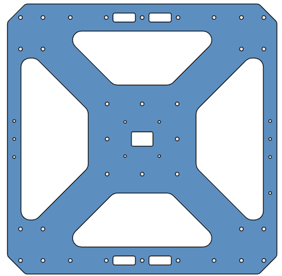

# **Project Quiver PT3 Structural Assembly Guide**

## BOM for the assembly

Table 1: Structure parts and additional material

| Part Nr. | Structure Part                                                                                                      | CAD ID  | Material | Sourcing | Quantity |
| -------- | ------------------------------------------------------------------------------------------------------------------- | -------- | -------- | -------- | -------- |
| 1        | Upper plate 2mm aluminum                                                                                            |1101 | | | 1        |
| 2        | Middle plate 2mm aluminum                                                                                           |1102 | |  | 1        |
| 3        | Cockpit Support Beam 40x40x2 mm aluminum (length: 124 mm)                                                                 |1212 & 1213 | | | 2        |
| 4        | Small square tube 40x40x2 mm aluminum (length: 289 mm)                                                                 | | | | 1        |
| 5        | Side rectangle 30x100x2 mm aluminum (length: 300 mm)                                                                   | | | | 2        |
| 6        | Lower plate 4mm aluminum                                                                                       | | | | 1        |
| 7        | Folding arm adapter                                                                                                 | | | | 4        |
| 8        | CF motor beam (length: 360mm)                                                                                       | | | | 4        |
| 9        | CF landing leg beam (length: 400mm)                                                                                 | | | | 4        |
| 10       | CF landing leg bottom beam (length: 500mm)                                                                          | | | | 2        |
| 11       | Landing leg adapter top (aluminum)                                                                                  | | | | 4        |
| 12       | Landing leg adapter bottom (printed)                                                                                | | | | 4        |
| 13       | Battery slider                                                                                                      | | | | 2        |
| 14       | Rivet 1 (4mm Dia. for 2.5mm-4.5mm thickness; McMaster Part: [97525A251](https://www.mcmaster.com/97525A251))        | | | | 36       |
| 15       | Rivet 2 (4mm Dia- for 4.5mm-6.4mm thickness; McMaster Part: [97525A226](https://www.mcmaster.com/97525A226))        | | | | 10       |
| 16       | Screw 1 (Hex Drive Flat Head Screw M3x8, McMaster Part: [**92125A128**](https://www.mcmaster.com/92125A128)**)**    | | | | 48       |
| 17       | Screw 2 (Flanged Button Head Screw M4x10; McMaster Part: [97654A373](https://www.mcmaster.com/97654A373))           | | | | 24       |
| 18       | Screw 3 (Socket Head Screw M3x16; McMaster Part: [91292A115](https://www.mcmaster.com/91292A115))                   | | | | 24       |
| 19       | Washer 1 (General Purpose Washer 3.2mm ID, 6mm OD; McMaster Part: [98689A112](https://www.mcmaster.com/98689A112/)) | | | | 24       |
| 20       | Nut 1 (Nylon-Insert Locknut M3; McMaster Part: [**90576A811**](https://www.mcmaster.com/90576A811/)**)**            | | | | 24       |

## Preparation

### Parts 1-3
- All three are aluminum 6 series sheets, laser cut, sanded. 
- Bounding box dimension is 300x300x2 mm for each.

| | Part 1 (Upper Plate) | Part 2 (Mid Plate) | Part 3 (Lower Plate)|
|--|--|--|--|
|Thickness|2 mm|2 mm|4 mm|
| Image|  |  |  |  
| CAD File|[Part 1](assets/models/part1.step)| [Part 2](assets/models/part2.step)| [Part 3](assets/models/part3.step)|

### Parts 4-6
- All three are aluminum 6 series, 40x40x2 mm square tubes, laser cut, sanded. 
- Part 5 and Part 6 are identical, order 2 parts for the same geometry.

| | Part 4 (Cockpit Support Beam CW Long) | Part 5 & 6 (Cockpit Support Beam CCW Back & Front) |
|--|--|--|
|Length|289.2 mm|124.2 mm|
| Image|  |  |
| CAD File|[Part 4](assets/models/part4.step)| [Part 5 & 6](assets/models/part5_6.step)|

## Parts 7-8
- Both are aluminum 6 series, 1000x30x2 mm rectangular tubes, laser cut, sanded.
- Length is 300 mm for each.
- Parts are identical, order 2 parts of the same geometry.

| | Part 7 & 8 (Battery Wall Left & Right) |
|--|--|
| Image|  |
| CAD File|[Part 7 & 8](assets/models/part7_8.step)|

## Part 9
- Off-the-shelf component.
- 30 mm option.
- 4 parts in total.
- Product Link: [Link](https://www.alibaba.com/product-detail/30-40mm-Folding-arm-tube-Drone_1600762096177.html?spm=a2756.order-detail-ta-bn-b.0.0.78e1f19cegXkOZ)

## Parts 10-12
- 30x2 mm circular carbon-fiber tubes with different lenghts.
- Reference link: [Link](https://www.rjxhobby.com/carbon-fiber/carbon-fiber-tube/rjx-1pcs-colored-3k-carbon-fiber-tube-1000mm-od-21-30mm)
  - Order 5 x 1000 mm or 10 x 500 mm

| | Part 10 (Motor Arms) | Part 11 (Landing Leg Vertical Tubes) | Part 12 (Landing Leg Horizontal Tubes) |
|--|--|--|--|
|Length|360 mm| 400 mm| 500 mm|
|Quantity|4|4|2|

## Part 13
- Off-the-shelf component.
- 30 mm option.
- 4 parts in total.
- Product Link: [Link](https://www.rjxhobby.com/rjx-1pcs-20mm-25mm-30mm-uav-tripod-aluminum-tilt-fixed-seat-landing-gear-connector?search=RJX3580&description=true)

## Part 14
- Off-the-shelf component.
- Part Number: GN 237-ZD-30-30-A-SW
- 2 parts in total.
- Product Link: [Link](https://www.jwwinco.com/en-us/products/3.3-Hinging-latching-locking-of-doors-and-covers/Hinges/GN-237-Zinc-Die-Cast-or-Aluminum-Hinges-Countersunk-Thru-Holes-or-Threaded-Stud-Type)

## Parts 15-23
- All 3D printed parts.
- They have structural roles on the airframe. Use **PETG-CF** filament.
- STL link:

|Part|Quantity|
|--|--|
|Part 15| 4 |
|Part 16| 2 |
|Part 17| 1 |
|Part 18| 1 |
|Part 19| 4 |
|Part 20| 1 |
|Part 21| 1 |
|Part 22| 1 |
|Part 23| 1 |

## Parts 24-29
- All 3D printed parts.
- The parts should not interfere with GNSS signals. Use **PETG** filament.
- **DO NOT** use any filament containing carbon fiber.
- STL link:

|Part|Quantity|
|--|--|
|Part 24| 1 |
|Part 25| 1 |
|Part 26| 1 |
|Part 27| 1 |
|Part 28| 1 |
|Part 29| 4 |

## Tool List

- You need the following tools:
  - Allen key set
  - Wrench set
  - Cordless screwdriver or drill press
  - Chamfering drill bit for 3mm holes
  - Riveting tool
  - Adhesive application tool
  - Loctite
  - Adhesive (for aluminum parts). Note: The adhesive is mostly to reduce vibrations. It's not really needed for structural robustness. The additional strength is just a positive additional point.
  - Cleaning agent
- Check if all the necessary parts are there

If you assembled it right your structure should look almost like the following picture.

