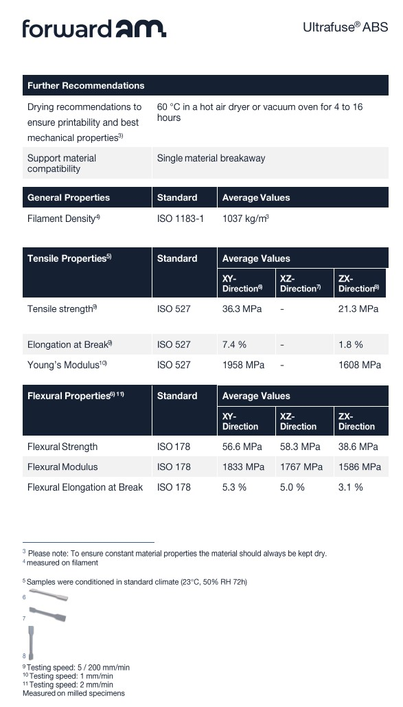

<!--Chinese language comparison included 包含汉语对照-->
# Status 

Valid

# Project Description

Due to Project Quiver has long used **FDM 3D printing** (Fused Deposition Modeling of Additive Manufacturing) to create various prototypes and structural components, but still lacking specific research into its material strength characteristics. Furthermore, the very basic **FEA** (Finite Element Analysis) workflow can only works for homogeneous parts like injection molding and metal, and cannot provide reliable results for 3D printed parts.

To alleviate this problem, it's necessary to collect some academic knowledge and industry standards to begin enhancing the understanding of 3D printing structures and improve the 3D printing structure design process of the project under the premise of controllable costs.

At the same time, this article will also organize some collected relevant parameters of mainstream and experimental component forming technologies and make a simple comparison between them.

<!-- 
由于Project Quiver长期以来使用**FDM 3D打印** (Fused Deposition Modeling of Additive Manufacturing）制作部分原型和结构件，但一直缺乏对其材料强度特性的具体研究，且最初级的**FEA**（有限元分析）工作流程仅适用于注塑、金属等均质部件，无法为3D打印件提供可靠结果。

为了缓解这个问题，有必要收集一些学术知识和业界标准，开始增进对3D打印结构的了解，并在成本可控的前提下改良项目的3D打印结构设计流程。

同时，这篇文章内将整理一些收集到的主流和实验性零部件成型技术的相关参数，并在它们之间进行简单对比。
-->

# Methodology 

Various of relevant online research results and academic papers will be searched and organized based on the past 3D printing experience in this study, and the AI assistant ChatGPT-o3 will be initiated to perform cross-reference and compare these academic and standard articles (will not using less logically rigorous language models such as 4o). 

Also some demo operations of Autodesk Inventor may be perform to generate solutions when necessary.
<!--
本次研究将基于过往的3D打印经验，在网络上搜索和整理相关的研究成果和学术论文，并使用AI助手ChatGPT-o3对收集到的文章和标准进行交叉查询和比对（将不使用4o等逻辑严密度较低的语言模型）。

必要时可能将执行一些Inventor的测试操作来生成解决方案。
-->

# Results and Deliverables 

## The Problem

FDM 3D printed parts are usually unable to acquire reliable results using simple homogeneous parameters FEA workflow. The reasons can be divided into two aspects as Macroscopic and Microscopic. Although the current project technical means cannot systematically analyze microscopic characteristics, but it's still worth listing and paying attention to them:

<!--
FDM 3D打印部件通常无法通过使用简单均质参数的FEA工作流得出可靠结果，原因则可区分为宏观和微观两大方面。虽然以项目现有技术手段无法对微观特性进行系统性的分析，但依然值得一并列出并加以关注：
-->

|Conditions|Results|
|-|-|
|**Macroscopic**||
|Various designs of layer thickness, wall thickness and infill percentage|Directly affects the transmission of force inside the component|
|The melting mode of inter-layers is different from in-layers. Which the in-layers is mainly continuous melting, while the inter-layers is secondary melting diffusion|Huge strength difference in between the XY (in-layer) and XZ (inter-layer) directions|
|**Microscopic**||
|Corners, over-extrusion, under-extrusion, and changes in speed and pressure curves generated by different slicing software|Uneven line widths, micro gaps, and even the carbonization differences|
|Long printing time|Internal stress generated between layers due to temperature gradients (also it's the cause of warping)|
|Filament from different storage environments and different levels of manufacturers|Impurities inside will affect the overall strength, such as water vapor|
|Different device and extruders with different hole diameters can produce different cross-sections|Gaps size between printed tracks are also different, and the sizes are nonlinear|
|...||

These characteristics above causes the require of **Orthotropic FEA** methods to solve FDM 3D printed parts, and various customized workflows are required between various infill designs. 

In short, compared to homogeneous parts, it's more difficult to achieve stable accuracy for FEA process of FDM 3D printed parts, also the FEA workflow can be varied.

<!--
宏观：
1. 各类不同的层厚、壁厚和infill百分比，会直接影响力在部件内的传递。
2. 层内的耗材分子连接连续性好，就像玻璃受热相变后又冷凝为单体。而层间则为强度较弱的二次熔融扩散连接，就像两块一经解冻又再次冷冻在一起的肉，外壁相互之间粘合。这个特征导致部件的XY（层内）与XZ（层间）方向之间强度差别巨大。（KBM简单注释：层间与层内的熔融方式不同，层内主要为连续熔融，层间则为二次熔融扩散。）

微观：
1. 切片软件产生的转角、过挤出、欠挤出，以及速度和压力曲线的变化，导致的不均匀线宽、微观间隙，甚至是碳化差异等。
2. 长时间打印，不同层之间因为温度梯度而产生的内应力（同时也是翘曲的原因）。
3. 来自不同存放环境和不同级别厂家的耗材，其中的杂质会对整体强度造成影响，例如水汽。
4. 不同设备或不同孔径的挤出机可产生不同截面的打印轨迹，导致打印轨迹之间的空隙大小也不相同，并且呈非线性。
   ...

上述这些特性导致FDM 3D打印件需要使用正交各向异性的FEA方法来求解，并且各种不同的infill设计均需要定制不同的工作流程。

总而言之，相对于与均质部件，FDM 3D打印部件的FEA过程更难达到稳定的精度，并且FEA工作流程可能多种多样。

-->

## Software Selection

There are many FEA software options on the market, different software may be targeted at different detail levels of FEA. Every project need to choose the correct software to perform its required FEA. For example, some software only works for simple deformation, some are suitable for anisotropy or nonlinearity, and some are even specialized only for microstructure of materials:

<!--
市场上的FEA软件有许多选择，不同软件可能针对不同细节程度的FEA。每个项目需要选择正确的软件才能进行其所需的FEA。例如，有些软件仅适合简单形变，有些适合各向异性或非线性，甚至有些仅专门针对材料微观结构：
-->

|Software|Simulation Functions|Availability|
|-|-|-|
|Autodesk Fusion|For homogeneous or isotropic materials|No (Below the current need)|
|Autodesk Inventor (with Nastran)|For isotropic, orthotropic, linear or nonlinear methods|**Yes** (Not expensive and well-functioning)|
|Siemens NX|...|No (Expensive)|
|Autodesk Netfabb|Fusion integrable 3D printing infill preparation and heat/stress simulation|No (Not for FDM, also expensive)|
|Digimat|For representative elementary volume (RVE) microscopic such as fabric fiber and micro mechanical|No (Too microscopic for current need)|
|...|||

Currently, most CAD / FEA software that supports orthotropic FEA methods are very expensive, including those examples in the list above. So the functions supported by low-cost software **Autodesk Inventor** will be mainly explained in this study.

<!--
目前，大部分支持正交各向异性FEA方法的CAD软件都非常昂贵，包括上述列表中的这些例举。因此本研究将主要阐述低成本软件**Autodesk Inventor**所支持的功能。
-->

## Material Data Preparation

### Start From Manufacturer's Parameter Card

Compared to isotropic / homogeneous materials FEA , more amount of research time are required for collecting filament characteristic data, due to more parameters are required for orthotropic FEA.

For filament manufacturers with good reputations and comprehensive testing procedures, the filament performance sheet or document can usually been found on corresponding product webpage, which should include most of its basic parameters, as example shown in the figure below:

<!--
相比于各向同性 / 均质FEA，正交各向异性FEA需要更多参数，因此需要更多研究时间来收集filament特性数据。

对于声誉良好且测试环节完善的filament制造商，filament的性能表或文档通常可在相应的产品页面中找到，其中应包含其大部分基础参数，例如下图所示：
-->

|BASF Ultrafuse ABS|BambuLab ABS|
|-|-|
|||

A detailed material characteristic table required for orthotropic FEA is shown below. The data provided by the manufacturer document can be used directly for some items. For items where the data is missing from manufacturer document, a series of standards tensile and shear tests is recommended to obtain the missing data, which according to the standards described in the table below:

<!--
以下是进行正交各向异性FEA所需的详细的材料特征卡，部分项目可以直接使用厂家文档所提供的数据。对于厂家文档中缺乏的数据，则建议进行一系列的拉伸和剪切试验来取得，对应下表内所述的标准：
-->

(In order to unify the test environment and values, a fully ISO standards test environment is recommended for the entire test process deployment, and the ASTM standards should only be used in special circumstances. Also, this sheet is only applicable for ambient temperature environments or non-thermal analysis workflows.)

|#|Item|Symbol (Unit)|Possible Ways To Obtain|
|:-|-:|-|-|
|1|Density of fresh filament|ρ (g/cm3)|Usually provided perfectly / Test by ISO 1183-1|
|2|Young's / Tensile Modulus X|Ex (Gpa)|Usually provided / Test by ISO 527-2|
|3|... Y|Ey|Test by ISO 527-2|
|4|... Z|Ez|Usually provided / Test by ISO 527-2|
|5|Shear Modulus XY|Gxy (Gpa)|Test by ISO 4587|
|6|... YZ|Gyz|...|
|7|... XZ|Gxz|...|
|8|Poisson’s Ratio XY|νxy|Test by ISO 527-2 with laterally strain measuring|
|9|... YZ|νyz|...|
|10|... XZ|νxz|...|

Following intermediate results could be also saved for further use during the test:

<!--
可以保留以下中间结果以备后续测试时使用：
-->

|#|Item|Symbol (Unit)|Possible Ways To Obtain|
|:-|-:|-|-|
|1|Tensile Strength X|σx (Mpa)|Usually provided / Test by ISO 527-2|
|2|... Y|σy|Test by ISO 527-2|
|3|... Z|σz|Usually provided / Test by ISO 527-2|
|4|Shear Strength XY|τ12 (Mpa)|Test by ISO 4587|
|5|... YZ|τ23|...|
|6|... XZ|τ13|...|

### To Fulfill By Standard Testing

Additionally, diagrams, descriptions and purpose of all required test standards are shown in the table below, including the ISO 178 bending test which is not strictly required for orthotropic FEA:

<!--
另外，下表是展示了全部所需的测试标准的图解、说明和目的，其中包括了对于正交各向异性FEA来说并不严格必需的ISO 178弯曲测试。
-->

|Standard|Diagram|Method|Purpose to get|
|-|-|-|-|
|ISO 178||Flexural testing by press on center of the large surface|Flexural strength and modulus|
|ISO 179-2(a) and ISO 180(b)||Charpy(a) and izod(b) destructive impact testing by strike on two different points of the longitude side|Charpy and izod impact strength|
|ISO 527-2||Slowly pulling to break apart the bone shaped specimen|Tensile modulus and strength|
|ISO 4587||Slowly pulling to break apart the single lap shaped specimen|Shear modulus and strength|

### Test The Standard Testing Specimens

When preparing test specimens, a strictly accordance to the dimensions specified by the respective ISO standards should be applied to the 3d printing models, and any scaling or styling modifications should be avoided.

When slicing the model, 3 different orientated specimens G-code should be generated by rotating the model for three main axes. This allows the inter-layer performance of the specimen to vary between the XY, XZ, and YZ axes. Using ISO 527-2 as an example:

<!--
在准备测试样本时，应严格按照各个ISO标准所规定的尺寸制作3d打印模型，且不应对模型进行任何缩放和造型修改。

在slicing模型时，应通过旋转模型的三个主轴生成三个不同方向的样本的G-code，用于使样本的inter-layer之间表现出在XY、XZ、YZ三个轴向上的不同性能，以ISO 527-2为例：
-->

In normal, Those standard tests procedures used by filament manufacturers typically utilize 100% solid-fill specimens to reflect the theoretical optimal performance of their filament.

However, if the project part which plan to perform FEA solution is a non-solid-fill part with a regular infill pattern inside, the same wall thickness and infill settings as the project part should be applied to its corresponding specimen during slicing in order to simulate the designed internal structure of the project part：

Furthermore, a very small ratio or very large size of infill pattern may can't fully accommodate by a standard size specimen, so **the standard test is only applicable to parts designed with an infill density of 20 % or more**. And wall thickness of specimen should be kept within a reasonable range, to prevent interruption to the infill and affecting the reliability of the test results. In extreme cases, omitting the top and bottom surfaces of the specimen printings is recommended to maintain a simplified structural performance of infill and outer wall.

For articles on deploying the test environment, specific test procedures, and calculating various modulus, please refer to the respective ISO standard documents from its service provider.

<!--
通常情况下，Filament制造商所使用的标准测试流程通常采用 100 % 实心填充的测试条，以体现其filament的理论最佳性能。

但如果计划进行FEA求解的project零部件是非实心件，且内部为规则的infill模板，则需要使用与project零部件相同的壁厚和infill设置对其相应测试条进行slicing，以模拟project零部件的内部结构设计。

并且，考虑到标准测试条的尺寸难以完整容纳比例过小或体积过大的infill模板，所以标准测试仅适用于设计infill ≥ 20 % 的零部件。同时，测试条的壁厚也不能过大，以防止挤占infill的空间，影响测试结果可靠性。在极端情况下，甚至建议适度取消测试条打印件的顶面和底面，以尽量保证简化的infill和外壁结构性能。

关于部署测试环境、具体测试流程和计算各个模量的文章，请另行向其服务商查阅各ISO标准文件。
-->

## Send The Components To Solve

The solution process for orthotropic FEA is similar to isotropic FEA, and does not have a steep learning curve, but the main differences are the material parameters and the axial specification in certain cases:

- Before starting the solution, manually 'Shell' the project part to the designed wall thickness, and fill the interior with the designed infill pattern for slicing.
  - The designed infill ratio should be greater than 20%.

- Fill the material card with material characteristics obtained from all the preparation. (See the [Inventor official documentation](https://help.autodesk.com/view/NINCAD/2025/ENU/?guid=GUID-1379B1A4-009C-4D58-8CF7-CC84D4255B23))
  - The material characteristics obtained from the exact same infill parameters test specimens should be used.

- Confirm the the material characteristics orientation of the project part.
  - The default Z-up orientation is suitable for parts with the Z axis pointing upward with no orientation changing while printing according to the conventional understanding of FDM 3D printing.
  - The part's material orientation must be adjusted, if the part plans to be reoriented or the inter-layer axis is not facing upward while printing. (See [Inventor official documentation](https://www.autodesk.com/support/technical/article/caas/sfdcarticles/sfdcarticles/How-to-define-the-material-axes-in-Nastran.html))

- Subdivide the model into finite elements.
  - Visual inspect for the model interior should be performed to ensure that the infill has been subdivided and contains sufficient elements.
  - This can result in a very large number of elements, the expected total time of the subdivision and solution process could be 2 to 3 times comparing to isotropic FEA workflow.

- Start to solve the project part workspace after all preparation above is complete.

- Begin comprehensive improvements to the corresponding project parts based on the latest FEA solution results.
  - Any improved parts should undergo field stress testing, flight tests, and observation. The ideal deviation between field test results and FEA results should be less than 20 %.
  - It's necessary to retain redundant structures instead of reduce the structure and safety factor when addressing FEA deviation in future designs.

<!--
正交各向异性FEA的求解工作流程类似于各向同性FEA，并无陡峭的学习曲线，但主要区别是材料参数和特定情况下的轴向指定。

- 在开始求解前，需要通过手动建模的方式，将project零部件的模型抽壳至设计的壁厚，并将其内部填入slicing时设计的infill模板。
  - 设计infill比例应大于 20 %

- 在材料卡内填入经由所有准备工作收集到的材料参数。（参见[Inventor官方文档](https://help.autodesk.com/view/NINCAD/2025/ENU/?guid=GUID-1379B1A4-009C-4D58-8CF7-CC84D4255B23) ）
  - 应使用infill参数相同的测试条所得出的材料参数。

- 确认项目部件的材料特性方向。
  - 按FDM 3D打印的常规理解方式，默认的Z轴向上适用于打印时不会改变朝向的部件。
  - 若部件计划在打印时需要改变朝向，即非inter-layer轴朝上的场景，则必须对部件材料进行定向。（参见[Inventor官方文档](https://www.autodesk.com/support/technical/article/caas/sfdcarticles/sfdcarticles/How-to-define-the-material-axes-in-Nastran.html)）

- 将模型进行细分为有限元。
  - 应在模型内部进行目视检查，以确定infill已被细分，且包含足够的元素。
  - 可能产生极大的元素数量，预计细分和FEA运算的耗时为各向同性FEA工作流的2至3倍。

- 在上述准备完成后，对project零部件场景开始求解。

- 基于最新FEA解算结果，即可开始对相应的零部件进行全方位改良。
  - 改良后的project零部件应经过实地载荷测试、试飞和观察，且实地测试结果和FEA结果之间的理想误差应小于 20 %
  - 在后续设计中处理FEA误差时，有必要保留冗余结构，而不是精简结构和安全系数。
-->

## Additional Tip For Actual 3D Printing Manufacturing

However, the following known methods should be applied to further improve the printing strength, if the final FEA results differ too much from the test (> 20% deviation) or the FEA results cannot be trusted for any reason :

<!--
然而，如果最终FEA结果与测试差异过大（误差 ＞ 20 %）或因任何原因导致FEA结果无法确信，目前已知只能通过以下方法尝试进一步提高打印强度：
-->

|Procedures|Theory|
|-|-|
|**Design**||
|Use 1.5 ~ 2 times of wall thickness|Increase interlayer connection strength|
|Double the amount of corner braces and reinforce beams|Directly improve wall strength|
|Use chamfered corner design more often|Increase the bending strength around corners|
|**Slicing**||
|Use better force spreading infill patterns|Disperse the load force into different directions or other fasteners|
|Optimizing print direction|Minimize shear and tension risks between layers by reorient the slicing|
|Enable brick layer slicing|Improve theoretical tensile strength by 5 ~ 10 % for most filaments|
|**Printing**||
|Dry the filament at the specified temperature and time before printing|Maintain consistent filament performance at all lengths|
|Increase the nozzle and chamber temperature|Reduce cooling gradient for interlayer fusion connection|
|Reduce cooling effect|Make molecular chains of fresh extruded traces better connecting between neighbor traces|
|Minimize the print layer height|Increase interlayer fusion area for better connection|
|**Post Processing**||
|Sufficient annealing treatment|Make molecular chains better connecting in all direction and try release any internal stress|
|Epoxy resin infill|Simulating the effect of reinforced concrete by taking advantage of the hollow nature of 3D printing|

## Brief Comparison Of Available Manufacturing Processes

It's well known, the product strength of common FDM 3D printing method cannot match with injection molded parts, regardless of whether industrial-grade equipment is used or whether fiber filaments are involved, even within the same material specifications. And 3D printing also lacks the flexibility of material selection comparing to injection molding. 

However, the FDM 3D printing offers a clear advantage in the application of non-load-bearing parts with its rapid design iteration capabilities, which injection molding cannot match.

In reality, there're other more advanced 3D printing technologies are gradually approaching or even surpassing the strength of injection molding, while offering lower costs comparing to injection molding. However, these technologies also have limitations on material selection. Here is the comparisons:

<!--
 众所周知，使用常见的FDM 3D打印方法的产品强度无法比拟注塑件，无论是否使用工业级设备或是否包含纤维丝或使用相同材料规格，同时3D打印在材料选择上也不具有注塑件的灵活性。
 
 而FDM 3D打印工艺具有注塑无法比拟的可快速迭代设计的特性，因此在非受力部件的应用上有绝对优势。

 但实际上，其他更先进的3D打印技术已经在逐渐逼近甚至超越了注塑级强度，同时有着比注塑更加低廉的成本，但在材料选择上又存在限制。以下是对比：
-->

（All material values in the table are typical values）

 |-|FDM|SLS (Selective Laser Sintering)|MJF (Multi Jet Fusion)|Injection Molding|Metal SLM (Selective Laser Melting)|CNC Machining|
 |-|-|-|-|-|-|-|
 |Material characteristics|XZ Orthotropic|85 % Isotropic|97 % Isotropic|Isotropic *|90 % Isotropic|Isotropic|
 |Material Source|Common plastics filaments|PEKK PA11 PA12 PA12-CF/GF PA-AF(Aluminum-fill) PP TPU|PA11 PA12 PA12-CF/GF TPU|Plastics universal|Titanium 316L steel AlSi10Mg alloy Chromium Nickel Copper|Solid block or sheet object universal|
 |Material Customizability|Single filament|Dyeable|Dyeable|Multi ingredient mixable|Single powder|Single block|
 |Representative Materials|ABS|PA12|PA12|ABS|AlSi10Mg alloy|6061 aluminum alloy|
 |-|-|-|-|-|-|-|
 |Raw Material Density (g/cm3)|1.05|0.93|1.01|1.03|2.66|2.7|
 |XY Tensile Strength (MPa)|32|45|50|40|360|310|
 |XZ Tensile Strength (MPa)|18|85 % XY|97 % XY|= XY|90 % XY|= XY|
 |-|-|-|-|-|-|-|
 |Dimensional Accuracy (mm)|0.05|0.1|0.05|0.01|0.1|0.01|
 |Design-To-Deliver Time|Hours|Days|Days|Weeks|Days|Weeks|
 |Typical Starting Cost $|0.5|8|10|800|25|12|

  \* Controlled by different injection point designs. May perform simulation with Autodesk Moldflow or similar software.

## Questions & Uncharted Knowledge

- Can the 3D-printed part itself be used as a mold for a derivative design? Can it withstand the temperatures and pressures encountered in a mold?
- Are there reliable chemical curing methods as a lower-end alternative to injection molding? Such as epoxy or photosensitive resin?
- Can the outer wall of a 3D-printed part be strengthened by spraying a reinforcing coating?
- Are there low-volume, low-cost injection molding processes?

<!--
- 3D打印件本身是否可以衍生设计作为模具使用？是否可以承受模具所受的温度和压力？
- 是否有可靠的化学凝固方法作为注塑的下位替代品？例如环氧树脂或光敏树脂？
- 是否可以通过喷涂强化涂料的方法来增加3D打印件外壁的强度？
- 是否有小批量且低成本的注塑工艺流程？
-->

## Summarize

While this information note summarized the most accurate FEA method currently available for realistic FDM parts, but the accuracy of these FEA solutions remains uncertain. At the same time, those standard testing requires a certain amount of time, money and physical effort, which may result in parts relying on FDM 3D printing being less cost-effective than SLS or MJF parts which have nearly isotropic properties.

Therefore, This study recommend that orthotropic FEA should only be performed on parts for special cases (Such as low-cost FDM production and easy distribution are required). Otherwise, non-standard testing processes such as "manufacturing-testing-remodeling" should be performed to improve the mechanical properties of mass-produced FDM 3D printed parts, or consider directly using manufacturing methods such as SLS and MJF for mass production where FEA results are predictable.

<!--
虽然此information note已经总结出了目前已知最接近真实FDM部件情况的FEA方法，但此FEA求解结果的正确性依然存在不确定性。同时，标准测试需要花费一定时间、资金和体力成本，可能会导致依赖FDM 3D打印的部件在效益上劣于SLS或MJF等近似各向同性的部件。

所以本次研究建议，仅在特殊场景下才应对部件进行正交各向同性FEA（例如必须满足低成本FDM生产、易于分发等条件），否则应当使用 “制造 - 测试 - 修改模型” 等非标准测试流程来提高量产FDM 3d打印部件的力学性能，或直接考虑使用SLS、MJF等FEA结果可预期的制造方式进行量产。
-->

# Remarks 
(End of document)
