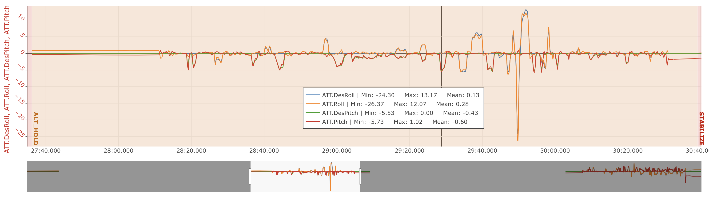
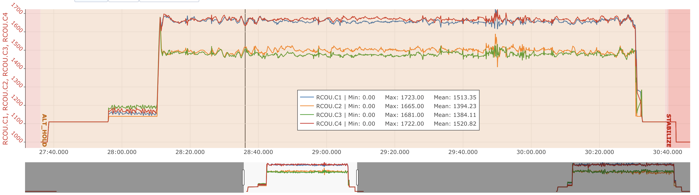
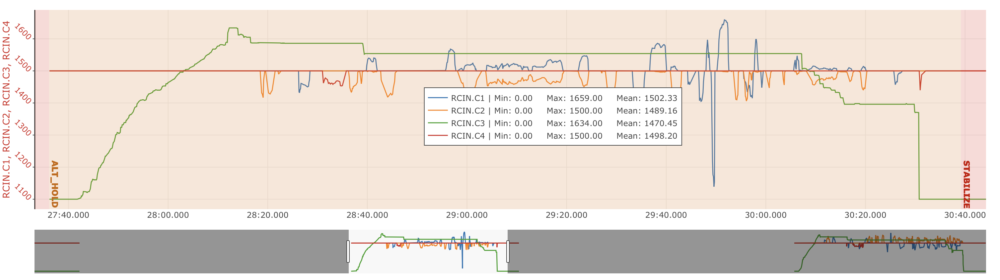
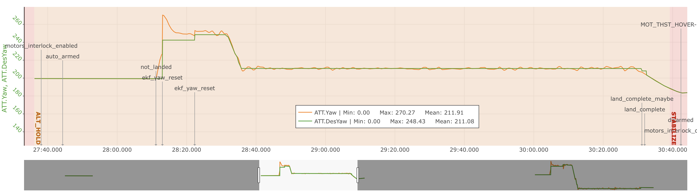
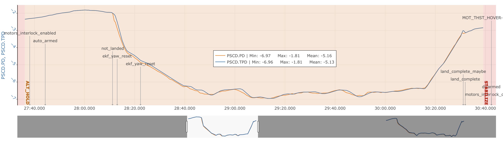

# Status  

`Valid`

---

# Project Description

This was the first official test flight of **Prototype 2 (PT2)** conducted in Germany. The goal was to evaluate basic flight behavior and onboard system responses in **Altitude Hold mode**, with the pilot actively monitoring the flight. The mode was selected to assist the pilot with vertical stabilization while ensuring manual lateral control for safety during the maiden flight.

## Flight Info
**Date:** April 14, 2025 - 16:24 (Local Time)  
**Location:** Germany  
**Aim:** First official flight, ALT mode

---

# Methodology

- Two consecutive flights were conducted in Altitude Hold mode.
- Full telemetry was recorded using onboard `.BIN` logs.  
- Post-flight analysis was performed with the Flight Log Analyser toolset to identify anomalies in sensor and actuator data.  
- Focus areas included: attitude control, motor outputs, compass behavior, vibration, battery and ESC data, GPS quality, and flight stability.

---

# Results and Deliverables

- Key plot visualizations (attitude, motor outputs)  
- Initial findings and issue list  
- Action items for hardware inspection and future tests  

---

## Issues Found

###  Pre-Flight

- No critical pre-flight errors; system passed basic health checks. Initial parameters and calibrations were checked with the team.

###  During Flight

- Compass error observed immediately after takeoff, likely related to EMI caused by the motors.  
- Despite the compass issue, AltHold mode maintained stable vertical control throughout the flight.

### Post-Flight & Log Review

- **Motor output imbalance** identified:
  - Motors **1 & 4** had higher average outputs (~1650) compared to **2 & 3** (~1500).
  - Initially suspected **CG imbalance** since the motors show a roll asymmetry.
  - Further investigation revealed **motor numbering mismatch**: Motors **1 and 3** were swapped.
    - Resulted in **CW motors** working significantly harder than **CCW motors**.
  - Further research showed that a **slight tilt (0.1–1°)** in the motor arms may have contributed to this motor output imbalance.
- No vibration or GPS problems were observed.

---

## Flight Test Summary

### Attitude Control

### Motor Outputs

### Pilut Inputs

### Yaw Control

### Altitude Control

# Remarks

- Compass EMI and motor numbering mismatch will be addressed before the next flight.
- Arm alignment will be verified mechanically using laser or leveling tools.
- The current test provided valuable insights and validated the importance of both mechanical symmetry for multirotor balance.
- Overall, it was a successful first flight.

---
