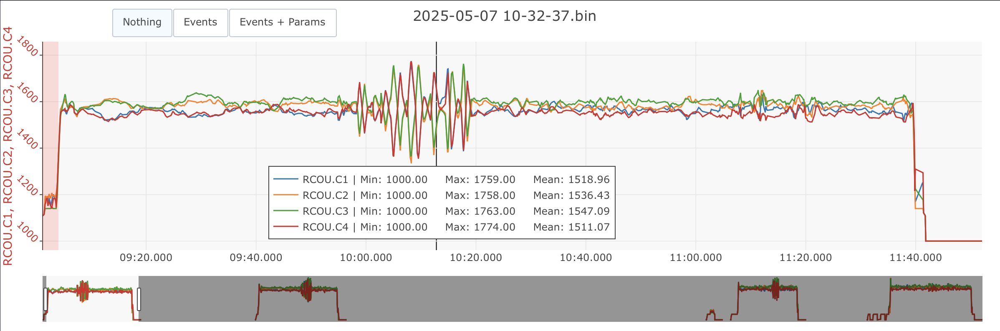
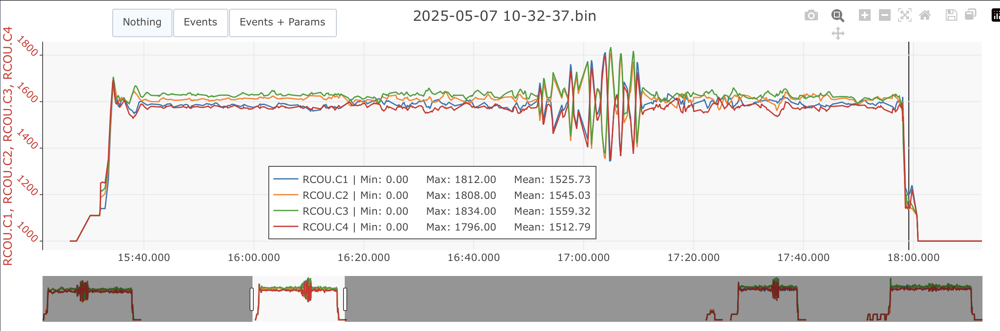
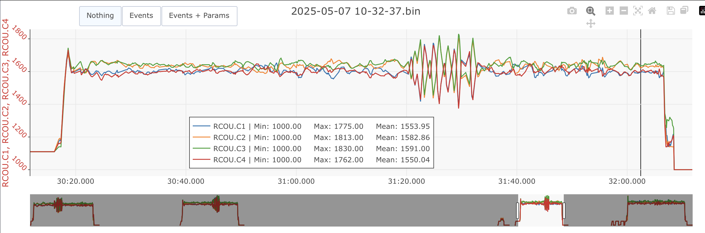
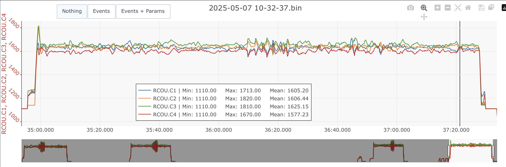

# Status  

`Valid`

---

# Project Description

The Project Quiver prototypes had not previously been tested under the 25 kg maximum takeoff weight (MTOW) condition. This test was conducted to evaluate system behavior across varying payload configurations, from empty weight to fully loaded. Subject to adequate control margin, the same motor, propeller, and ESC configuration is intended to be used for PT3.

## Flight Info
**Date:** May 07, 2025 - 10:32 (Local Time)  
**Location:** Germany  
**Aim:** Testing different payloads

---

# Methodology

- Four consecutive flights were conducted, starting from no payload condition. In each iteration, metal plates of 1.3 kg is added to the system. Here is a breakdown of the takeoff weights of each flight.

Empty Weight: 8.85 kg
Battery Weight: 11.30 kg

**1st Flight:**
No Payload
Takeoff Weight: 20.15 kg

**2nd Flight:**
3D printed dispenser (0.95 kg) and 1 metal plate (1.3 kg)
Takeoff Weight: 22.4 kg

**3rd Flight:**
3D printed dispenser (0.95 kg) and 2 metal plates (2x1.3 kg)
Takeoff Weight: 23.7 kg

**4th Flight:**
3D printed dispenser (0.95 kg) and 3 metal plates (3x1.3 kg)
Takeoff Weight: 25 kg

- Tests have been performed in Position Hold mode.

---

# Results and Deliverables

- Key plot visualizations (attitude, motor outputs)  
- Initial findings and issue list  
- Action items for hardware inspection and future tests  

---

## Issues Found

###  Pre-Flight

- No critical pre-flight errors; system passed basic health checks. Initial parameters and calibrations were checked with the team.

###  During Flight

- No issues.

### Post-Flight & Log Review

- All payload conditions have adequate control margin. 
- Mean hover PWM values for each weight:
	- 20.15 kg: 1528
	- 22.4 kg: 1535
	- 23.7 kg: 1569
	- 25 kg: 1603
- Attitude and yaw control was good in all payload conditions.
- No vibration or GPS problems were observed.

---

## Motor Outputs Summary

### 1st Flight

### 2nd Flight

### 3rd Flight

### 4th Flight

# Remarks
- Hobbywing XRotor X6 system seems to give adequate performance for MTOW condition, therefore, suitable for PT3.
- It should be noted that in MTOW condition, agile maneuvers are not recommended since it can result in hitting the maximum motor PWM limits.

