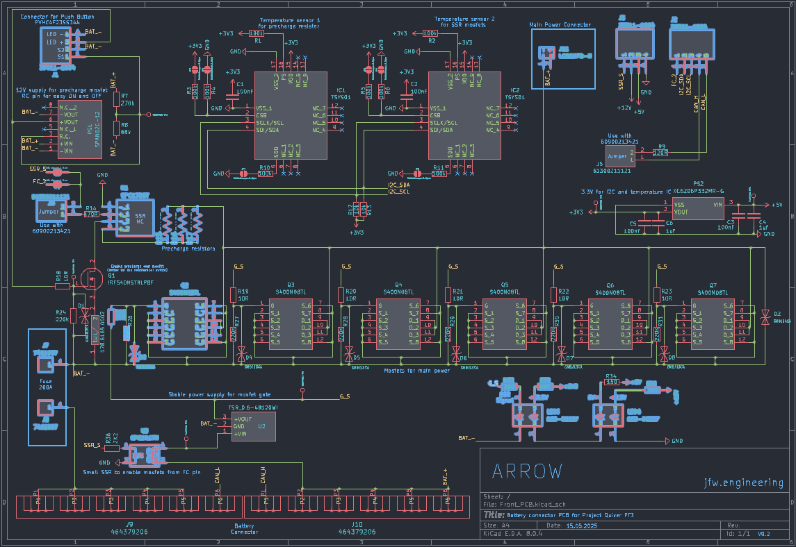
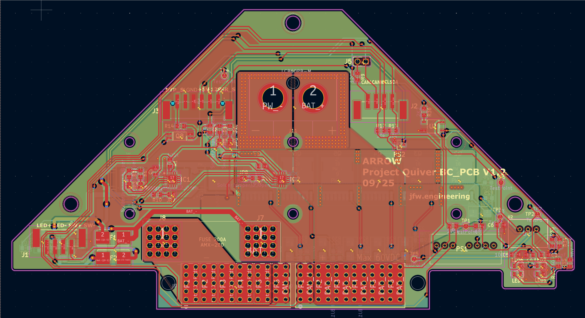
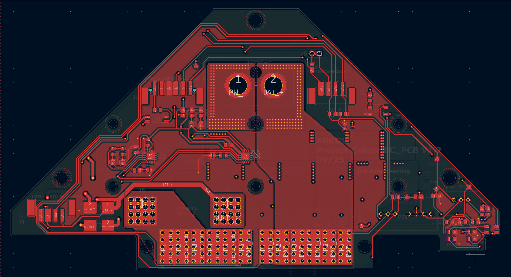
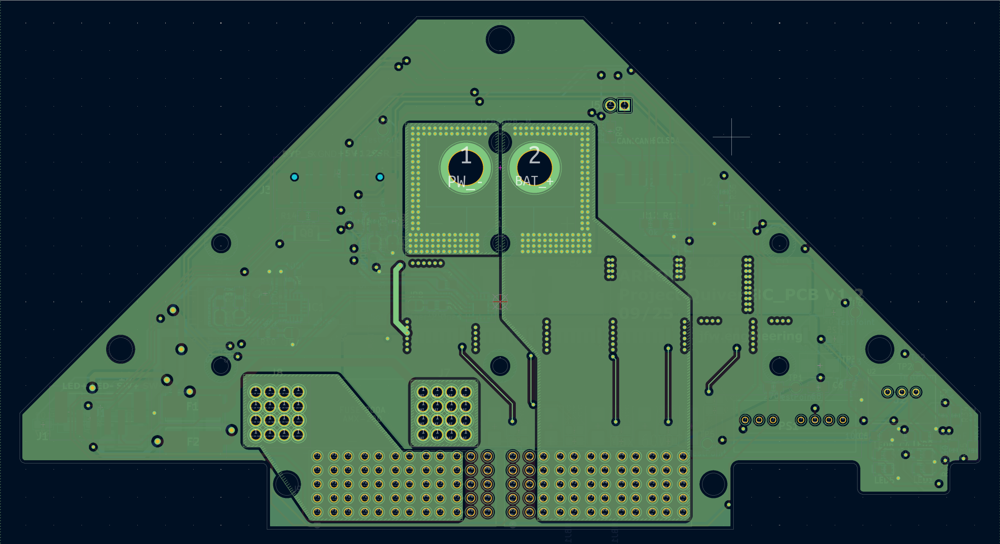
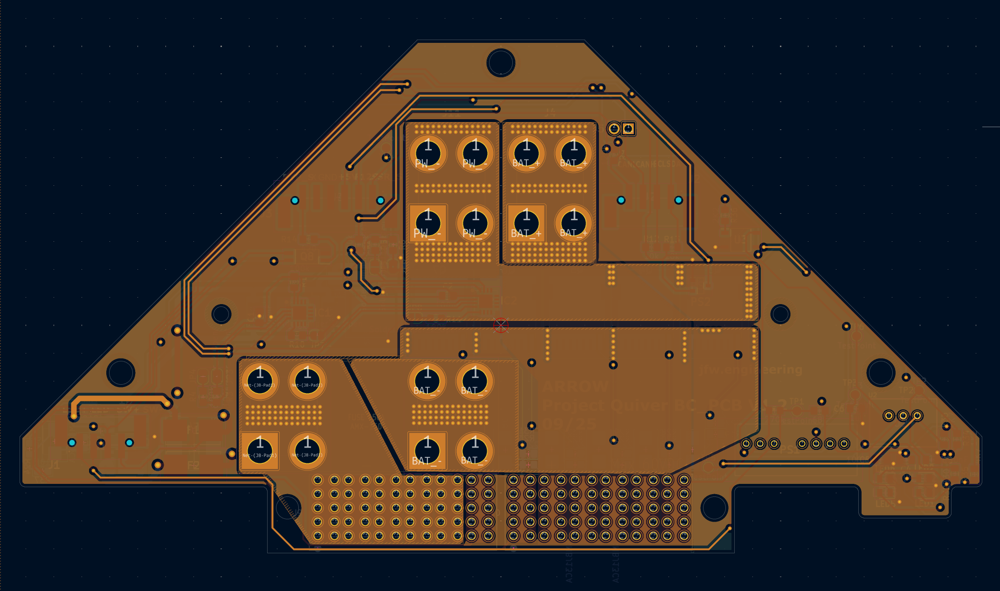

# PT 3 Battery PCB Updates

# Status

`Valid`

`Revision History: V1`

`Replacement Log: None`

`Reference: Updates to PT3 Battery information note`

# Project Description

## PCB Overview

The Battery PCB was updated to include various changes that were noticed during the build and testing process. Some changes were made to the components and operation of the PCB. Notably, the pre-charge bypass circuitry was moved from the Main PCB and other components upgraded to more robust versions. Additionally, some connectors were swapped or components removed entirely.

# Methodology

Updates were collected via the manufacturing, assembly, and testing process of Quiver PT3.

# Results and Deliverables

## Updated Schematics and CAD files

***Previous schematic with highlighted changes***

***Updated schematic with new components highlighted***

|           F.CU                            |                 In1.CU                      |                      In2.CU                 |                    B.CU                   |
|:-------------------------------------:|:-------------------------------------:|:-------------------------------------:|:-------------------------------------:|
| |  |  ||

## PCB Updates

- List of components updated/removed
    - J1-J3
    - U3
    - Q1
    - K1
    - IC1
    - R15-R17
    - LED5 & LED6
        - R32-R35
    - JP9 & JP10
    - J6
    - R14 (reassigned to pre-charge bypass)
    - J7 & J8 Press fit connectors replaced 
    - J11 & J4 New connector 
- List of new components for Pre-charge bypass
    - R14
    - R37
    - R38
    - D9
    - Q8
    - Q9
    - F2
    - F4
- U3 updated component number **CPC1019N**
    - rated for higher load current (750 mA)
        - previously 100 mA
- New fuse type for F1
- removed SSR control for pre-charge circuit
    - includes jumper for SSR_S and FC_2
- Updated MOSFET for pre-charge to SIR804DP-T1-GE3
    - higher rating
- Updated resistor values for pre-charge circuit
    - make note about why it was done
    - Updated from 150 Ohms to 50 Ohms
- Removed all Euro style plug connectors
- Bypass circuitry moved to this PCB
    - incoming signal from Main PCB
    - add description on operation
    - removed ring terminal coming from fuse
- Updated wiring and layout for LEDs
- Incoming connection updates
    - J2 (1839211)
        - 4 pin for comms
    - J3 (1778735)
        - 6 pin connector, only 5 used
            - signals and power

# Remarks

- Design work was conducted by Julius.
- Schematic and CAD files can be find in the Quiver PT3 task and bounties directory
- information note prepared by Erick.
