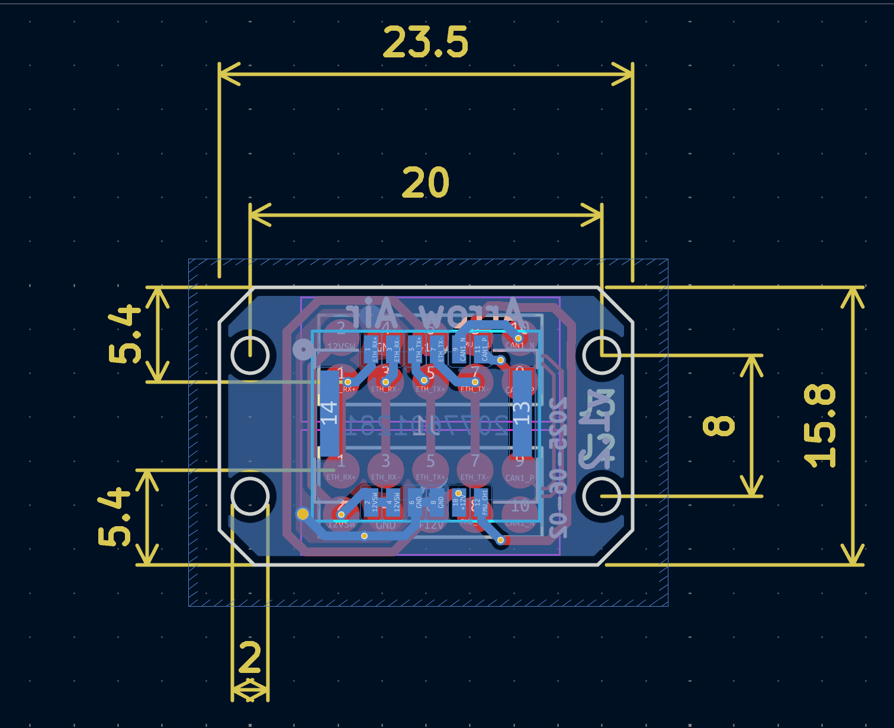

# Project Quiver Payload Attachment PCB

## Overview

The Project Quiver payload attachment PCB is a simple 2-layer board designed for quickly interfacing payloads with the main system. 
This board provides standardized connectivity and mounting options for various payload configurations.

## Design Features

- **2-layer PCB design** for cost-effective manufacturing
- **Dual 10-pin headers** for flexible connectivity options
- **4x M2 mounting holes** for secure mechanical attachment
- **Configurable gender orientation** - populate either male or female connectors as needed

## Hardware Specifications

### Connectors
- **2x 10-pin headers** (2.54mm pitch)
  - Header J3: Female/Flat receiver pin payload interface
  - Header J2: Male/pogo pin interface
  - **Population options:**
    - Install male headers for mating with female cables/boards
    - Install female headers for mating with male cables/boards
    - Populate only one header if single connection is sufficient

### Mechanical
- **Mounting:** 4x M2 threaded holes
- **Board dimensions:** 16mm height x 24mm width
- **Board thickness:** 1.6mm standard
- **Material:** FR4

## Assembly Instructions

### Component Population

1. **Header Selection:**
   - Determine required mating configuration
   - Install either male or female 10-pin headers (or both if needed)
   - Ensure proper alignment and orientation

2. **Mounting:**
   - Use 4x M2 screws for mechanical attachment
   - Recommended torque: screwdriver tightening, do not use impact driver or drill
   - Ensure even mounting pressure across all four points

### Pinout

**10-Pin Headers (J2 & J3):**

| Pin | J3 Function | J2 Function |
|-----|-------------|-------------|
| 1   | ETH_RX+    | ETH_RX+    |
| 2   | 12VSW      | 12VSW      |
| 3   | ETH_RX-    | ETH_RX-    |
| 4   | GND        | GND        |
| 5   | ETH_TX+    | ETH_TX+    |
| 6   | +12V       | +12V       |
| 7   | ETH_TX-    | ETH_TX-    |
| 8   | FMU_CH1    | FMU_CH1    |
| 9   | CAN1_P     | CAN1_P     |
| 10  | CAN1_N     | CAN1_N     |

**12-Pin MOLEX Locking Connector (J1 - 2077601281):**

| Pin | Function   | Description |
|-----|------------|-------------|
| 1   | ETH_RX+    | Ethernet receive positive |
| 2   | 12VSW      | Switched 12V power |
| 3   | ETH_RX-    | Ethernet receive negative |
| 4   | 12VSW      | Switched 12V power |
| 5   | ETH_TX+    | Ethernet transmit positive |
| 6   | GND        | Ground reference |
| 7   | ETH_TX-    | Ethernet transmit negative |
| 8   | GND        | Ground reference |
| 9   | CAN1_N     | CAN bus negative |
| 10  | 12V        | Main 12V power supply |
| 11  | CAN1_P     | CAN bus positive |
| 12  | FMU_CH1    | Flight Management Unit Channel 1 |

**Signal Descriptions:**
- **ETH_RX+/ETH_RX-**: Ethernet receive differential pair
- **ETH_TX+/ETH_TX-**: Ethernet transmit differential pair  
- **12VSW**: Switched 12V power output
- **+12V**: Main 12V power supply
- **GND**: Ground reference
- **FMU_CH1**: Flight Management Unit Channel 1
- **CAN1_P/CAN1_N**: CAN bus differential pair
s for maximum flexibility. J1 provides the same signals with additional ground pins for enhanced signal integrity and current handling.*
*Note: J2 and J3 headers have identical pinout

## Usage

### Configuration Options

1. **Single Header Configuration:**
   - Populate only J1 or J2 as needed
   - Use for simple payload interfaces

2. **Dual Header Configuration:**
   - Populate both headers
   - Enables 2x pin connections for each pinout

### Installation

1. Select appropriate M2 screws for your mounting surface
2. Align PCB with mounting holes
3. Secure with 4x M2 screws
4. Connect payload cables to populated headers

## Design Files

- Schematic: `QuiverAttachPCB.kicad_sch`
- PCB Layout: `QuiverAttachPCB.kicad_pcb`
- Gerber files: `/gerbers/`
- BOM: `QuiverAttachPCB_BOM.csv`

## Revision History

| Version | Date | Changes |
|---------|------|---------|
| v1.0    | 2025-06-02 | Initial release |

## Support

For technical questions or issues, please contact kellan@arrowair.com.

