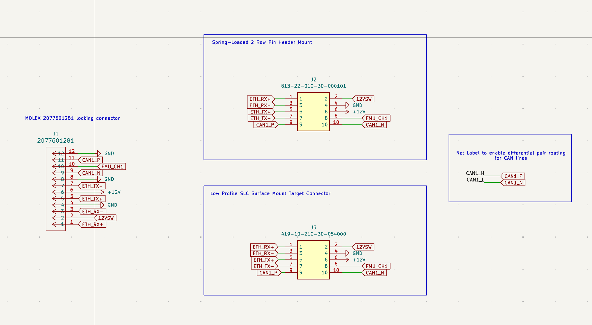
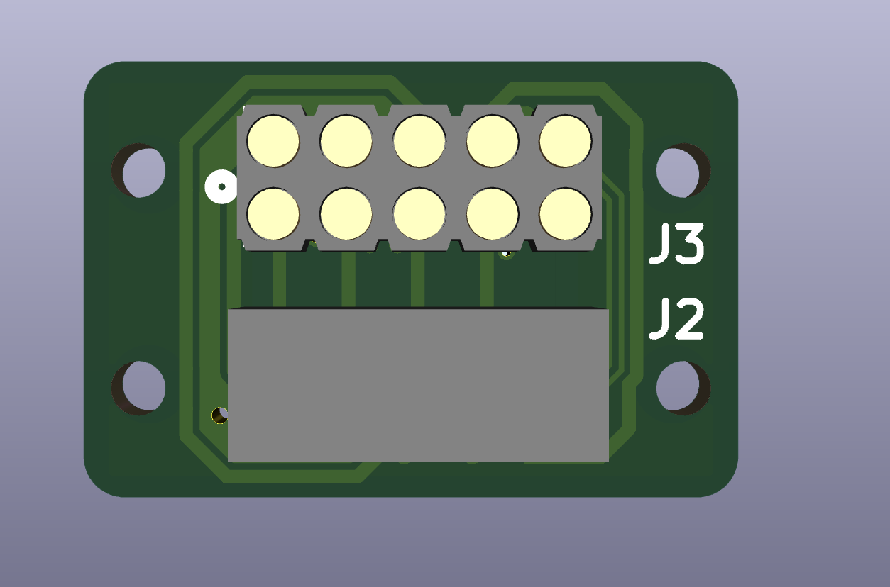
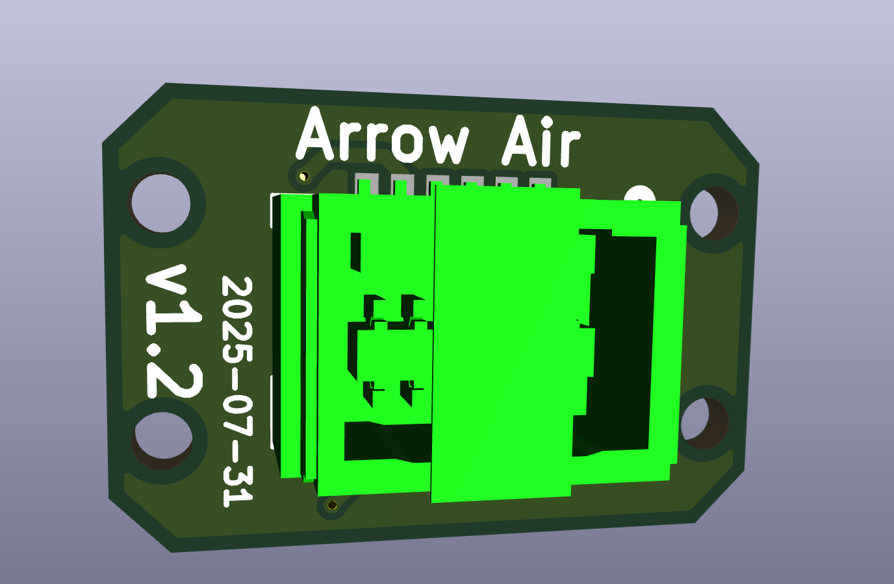

# PT 3 Attachment Interface PCB

## Status

`Valid`

`Revision History: None`

`Replacement Log: None`

`Reference: https://dao.arrowair.com/t/pt3-attachment-interface-pcb-bounty/124`

## Project Description

This grant is issued for the design and delivery of a 2-layer Attachment Interface PCB for Project Quiver. The board facilitates modular, standardized payload integration by providing power and signal routing between the main system and swappable attachments. This ensures robust electrical interfacing and mechanical compatibility with the quick-release payload system currently in development.

### Prior Art and Challenges

This PCB design was commissioned for the development of a more efficient interface between the Project Quiver drone and payload. The previous version used an off-the-shelf [quick release plate](https://www.alibaba.com/product-detail/Quick-Release-Clip-Plate-Clamp-Quick_1600982145247.html?) by JMRRC tech, which used a 10-pin POGO interface and a micro JST header.

The previous implementation introduced two challenges:

1) The thin wire gauge needed for micro JST headers limited the maximum power and current consumption of the payload.
2) The 10-pin layout, with doubled-up power and ground pins, limited the interface options for a payload, leaving at most a remaining 4 pins after 2x 12V, 2x 12V_GND, and a 5V and 5V_GND bus.

### Attempted Improvements

By using the 12 pin MOLEX 813-22-010-30-000101 header, we can duplicate the utility of a locking quick-release interface from the prior micro JST while improving the current-carrying capacity.

The 12 pins allows for doubling on power-carrying pins and interfaces, while still having room to introduce the CAN and Ethernet connections. This PCB design holds both the male and female connectors, mirrored across the long axis of the PCB, so that the single PCB layout can be populated to serve in either capacity.

## Methodology

Simple routing of a 2-layer PCB. This PCB represents both the male and female mating sides such that the single board can be used in either configuration based on which header is populated.

## Results and Deliverables

For technical discussion, please view the [README.md](README.md) file in this directory.

- **Problem to solve:**  
  Current payloads require hand-wired connections. We want to streamline payload swapping and power/signal delivery with a standard interface.

- **Deliverables:**  
  - KiCAD schematic and layout files (May 29)  
  - Gerber + drill files (May 29)  
  - Final BOM (May 30)  
  - Documentation with renders and integration notes (May 30)  

- **Outcomes:**  
  - A reproducible, reliable hardware interface for payloads
  - Open source documentation and reference materials for future use

### Images

- 
- 
- 
- 

### Design Constraints

- PCB Size
- Component placement
- Enclosure dimensions
- Layers
- Section for manufacturing constraints
  - PCB Trace width
  - Distance between traces

## Remarks

- Reference Molex part #2077601281 and mating part #2045231201
- CAD and physical integration will align with the Quiver quick-release payload plate
