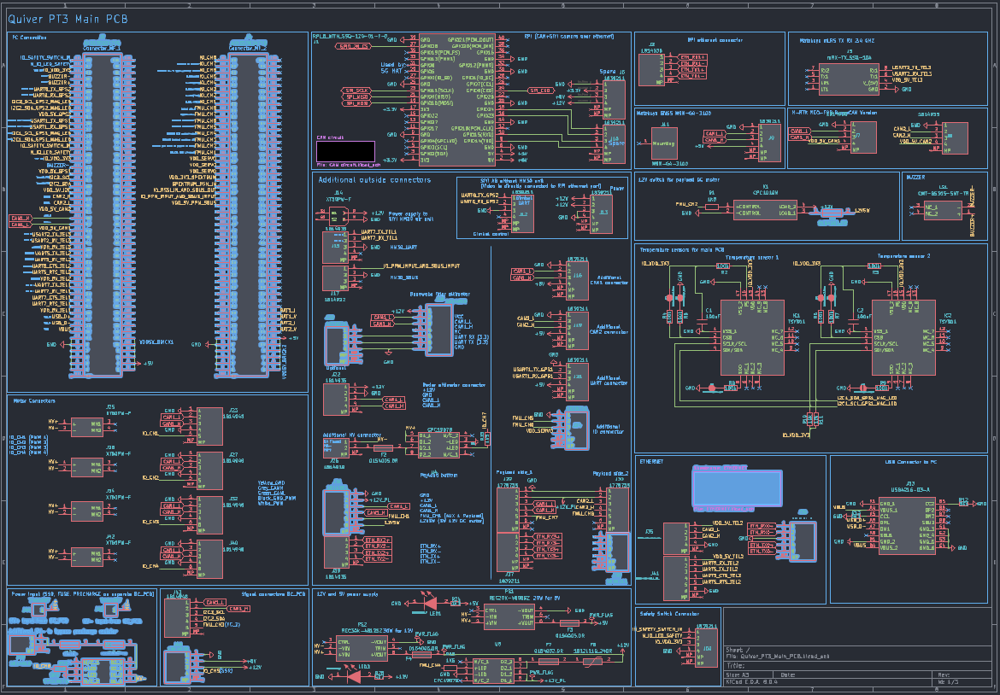
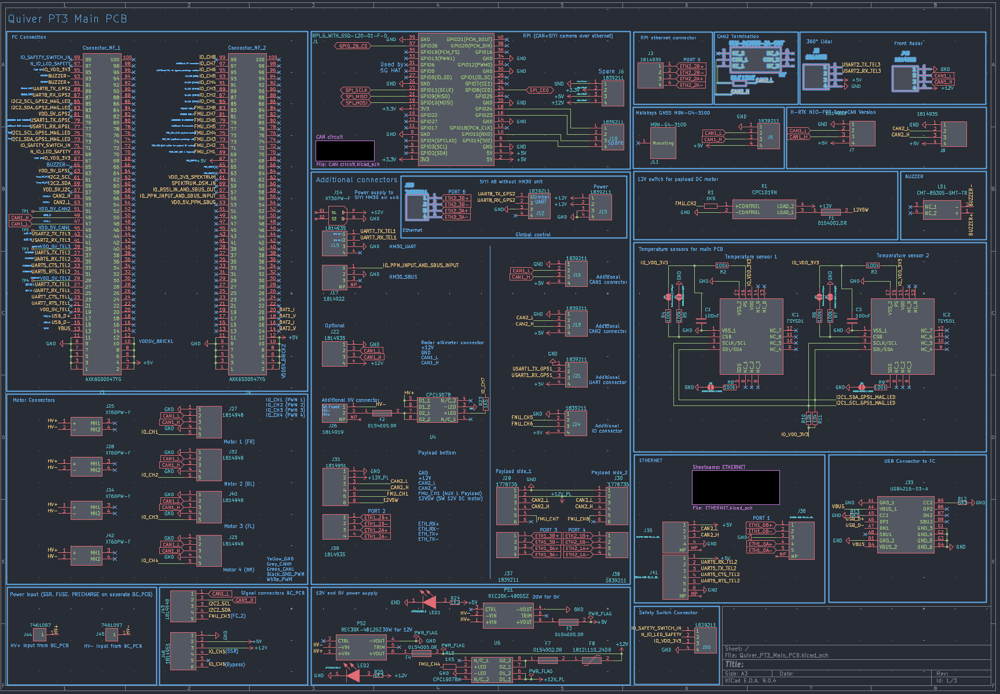
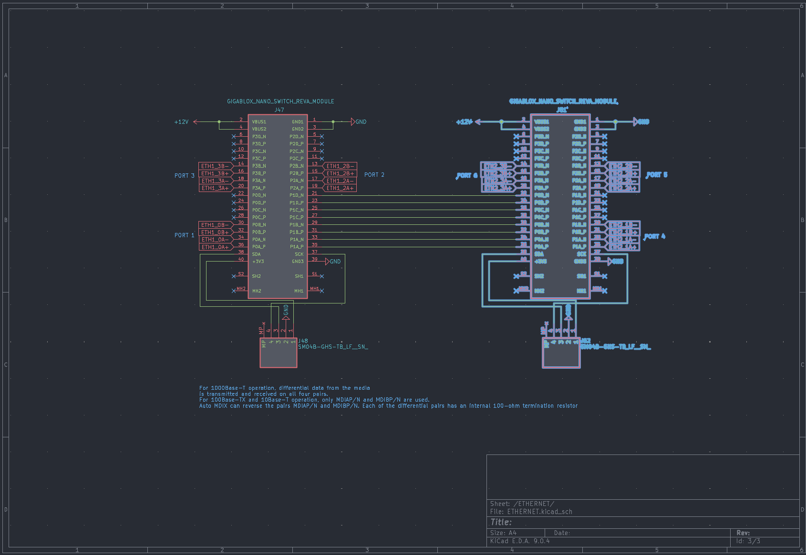
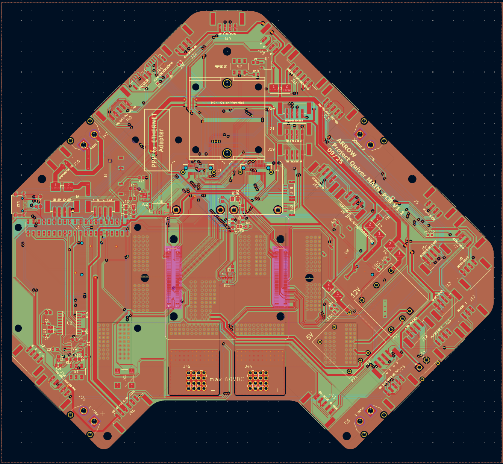
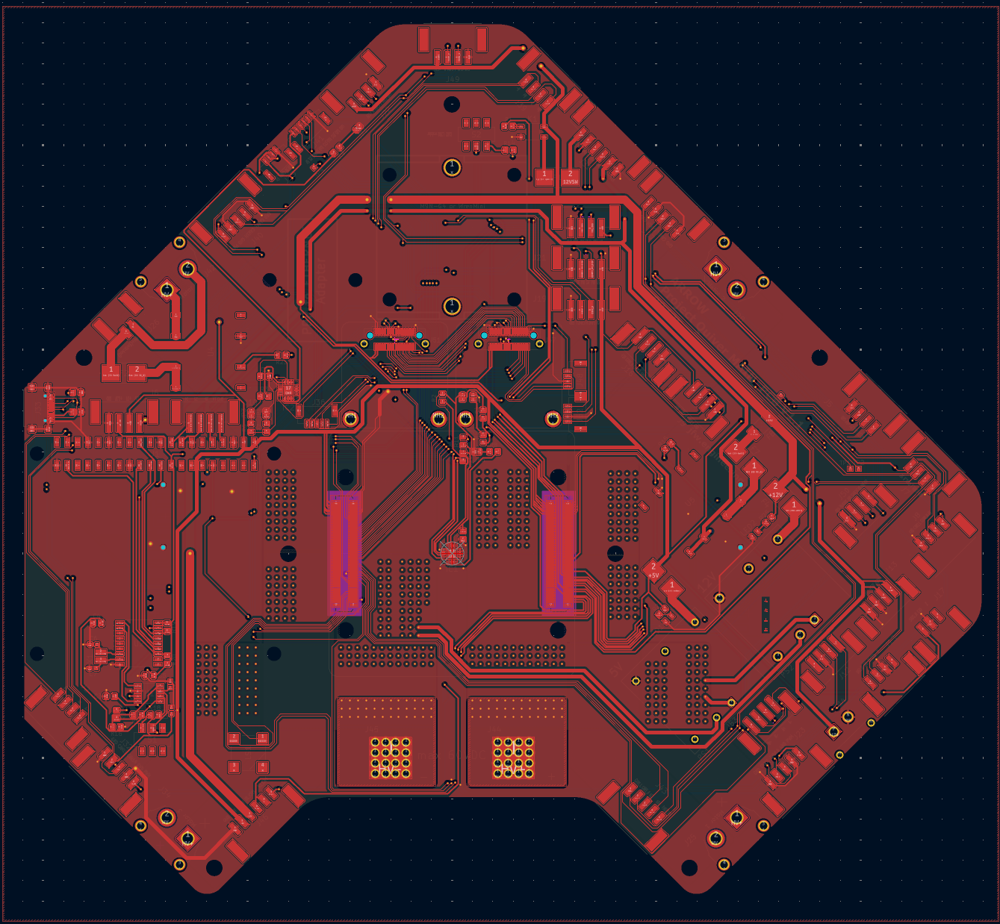
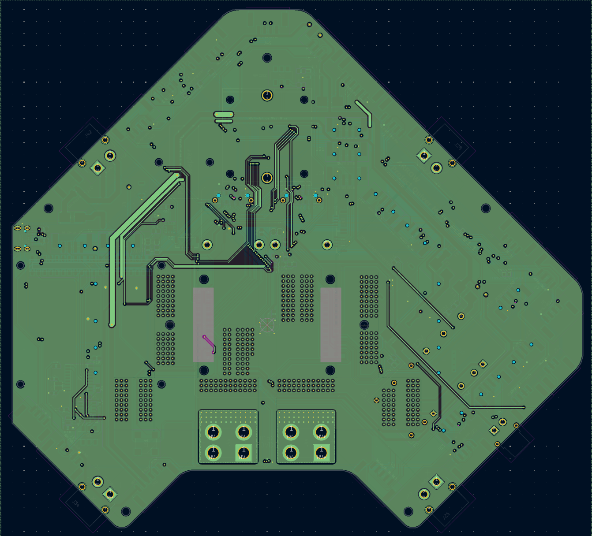
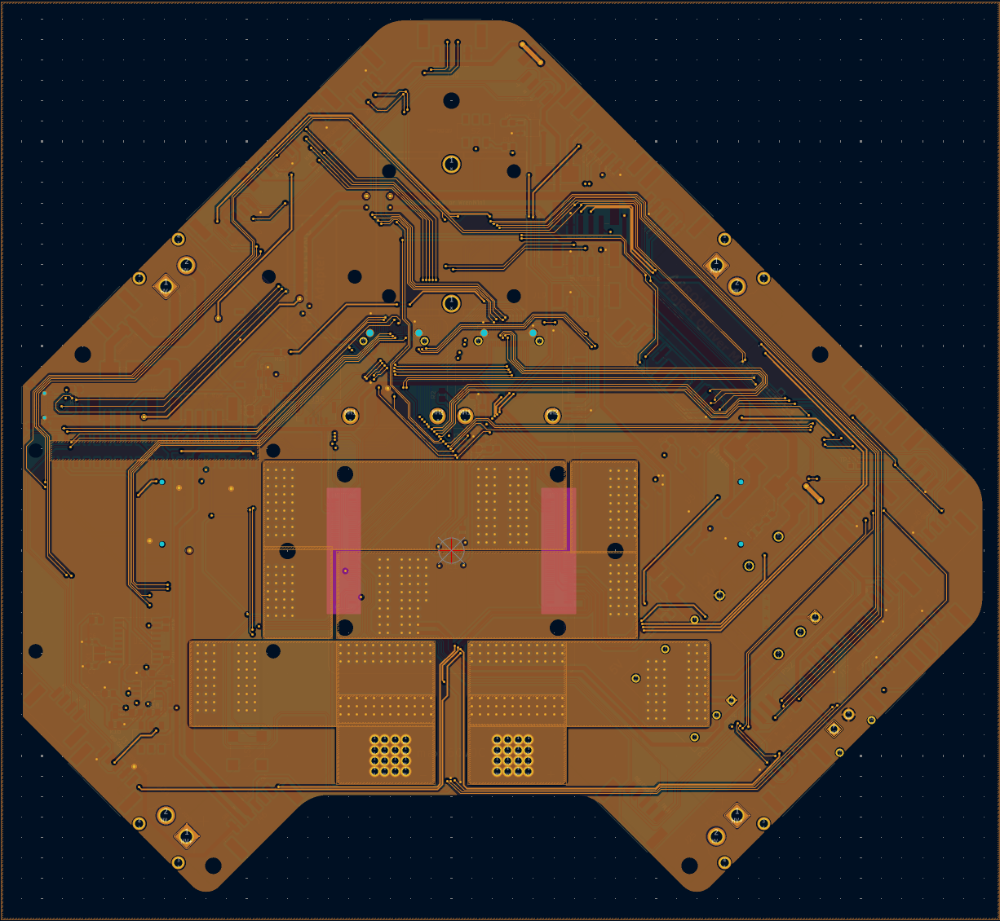
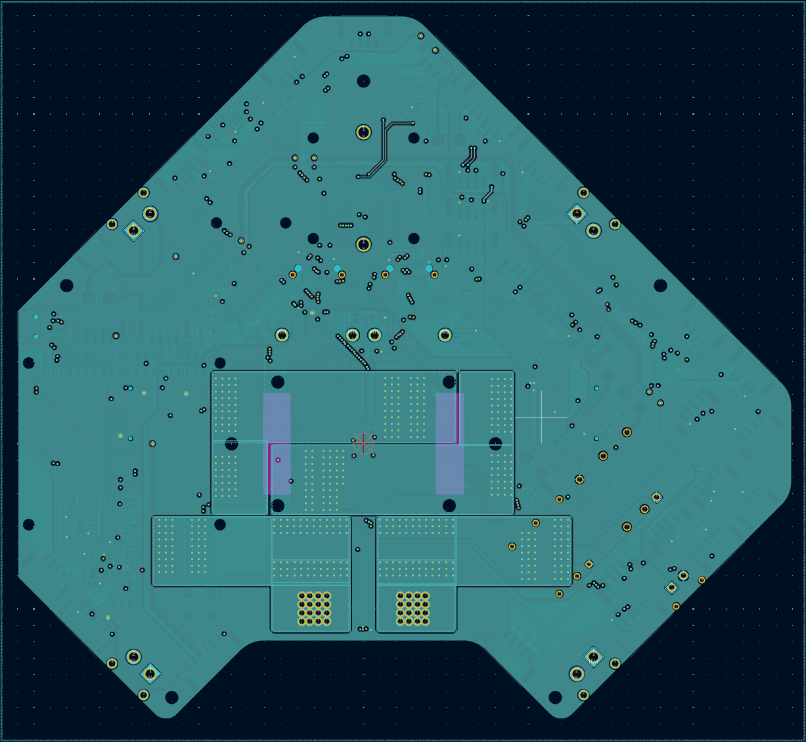
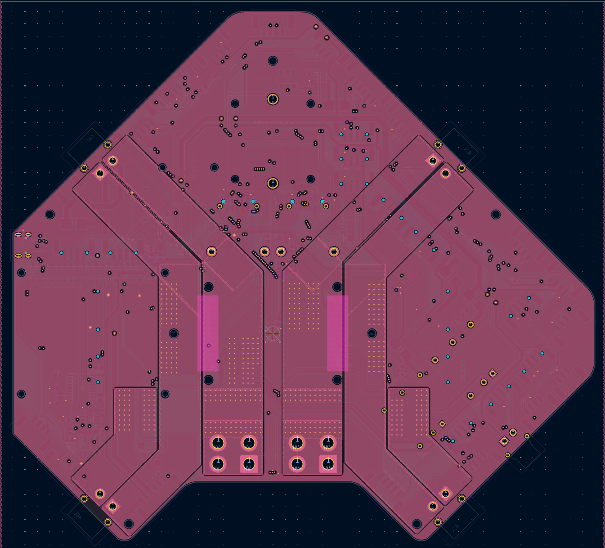
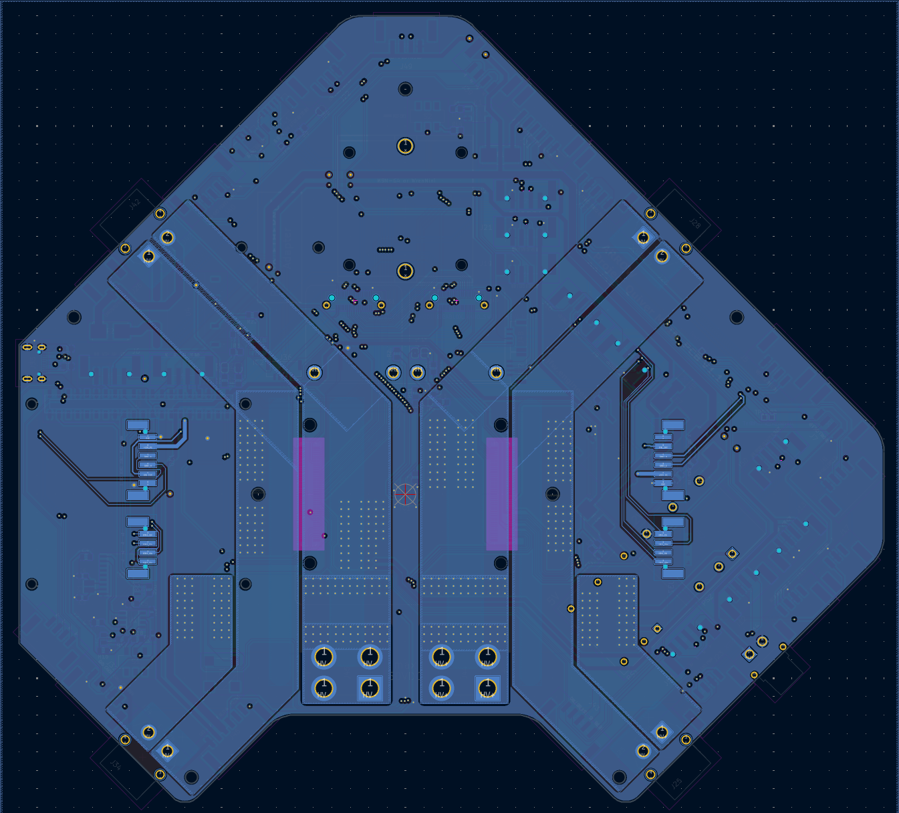

# PT 3 Main PCB Updates

# Status

`Valid`

`Revision History: V1`

`Replacement Log: None`

`Reference: Updates to PT3 Main PCB Information Note`

# Project Description

## PCB Overview

The Main PCB was updated to include various changes that were noticed during the build and testing process. Some changes were made to the components and operation of the PCB. Notably, an additional ethernet module with corrected wiring to support additional ethernet capable payloads, connectors for obstacle avoidance capabilities, and expanded CAN2 operation. Additionally, some components were upgraded with more robust variants or removed entirely. 

# Methodology

Updates were collected via the manufacturing, assembly, and testing process of Quiver PT3.

# Results and Deliverables

## Updated Schematics and CAD files

***Previous schematic with highlighted changes***

***Updated schematics with new components highlighted***

|           F.CU                            |                 In1.CU                      |                      In2.CU                 |                    In3.CU                   |           In4.CU                            |                 B.CU                      |
|:-------------------------------------:|:-------------------------------------:|:-------------------------------------:|:-------------------------------------:|:-------------------------------------:|:-------------------------------------:|
| |  |  || |  |

## PCB Updates

- Pre-charge bypass circuitry moved to the battery PCB
    - Following components removed
        - J49
        - F5 & F6
        - U3
        - R22
- J46 updated to a 6 pin Phoenix connector
    - Pre charge bypass signal assigned to Pin 6
- Ethernet changes
    - fixed wiring on J47 (module connector) to J48
    - add second Ethernet module connector (J51) and connector J52
    - Labels added for various Ethernet ports on schematic
        - nomenclature changed and wired to additional connectors
        - Labels added to the respective connector with “PORT X”
- Fuse F1 for the 12V switched (12V SW) output has been upgraded to 2A
- CAN2 operation has is more robust with the addition of switch S2 (179-SLW-913535-2ASMT) for termination resistor control
    - 120 Ohm termination resistor (R14) added
- Obstacle detection features introduced with a 360° Lidar (J5) and forward facing radar (J49)
- J38 wired to ethernet port 4
- J24 Pin 4 reassigned to 5V
- J53 (1839211 4 pin Phoenix) added Ethernet port 6
- Removed J20 and J18
    - connectors for Benewake Lidar no longer needed
        - can use other connectors if it is required as an option
- J31 pins 3 & 4 reassigned to CAN2_L and CAN2_H because all payloads will operate on CAN2
- Replaced 100 pin socket with header (AXK6S00547YG) on J3 & J4 for physical stability

### Remarks

- Design work was conducted by Julius.
- Schematic and CAD files can be found in the Quiver PT3 task and bounties directory
- information note prepared by Erick.
