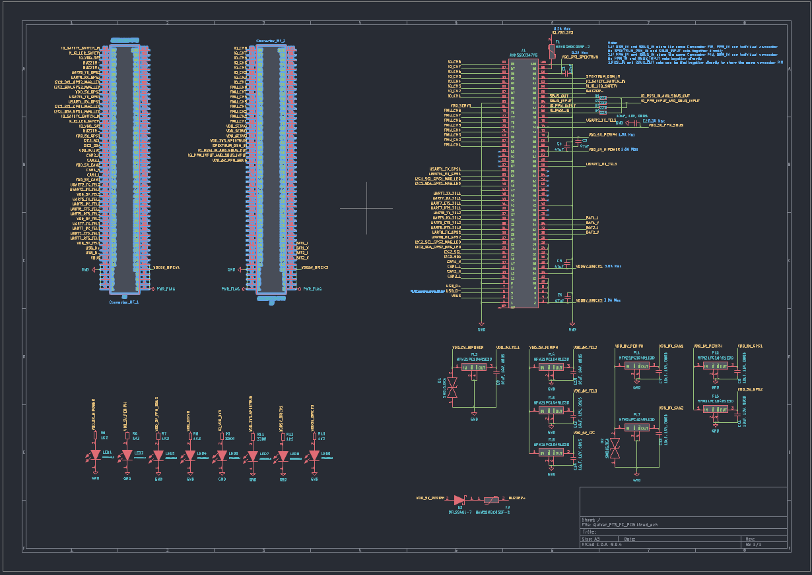
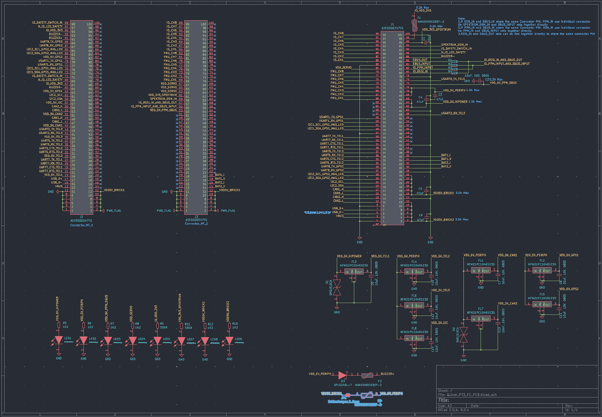
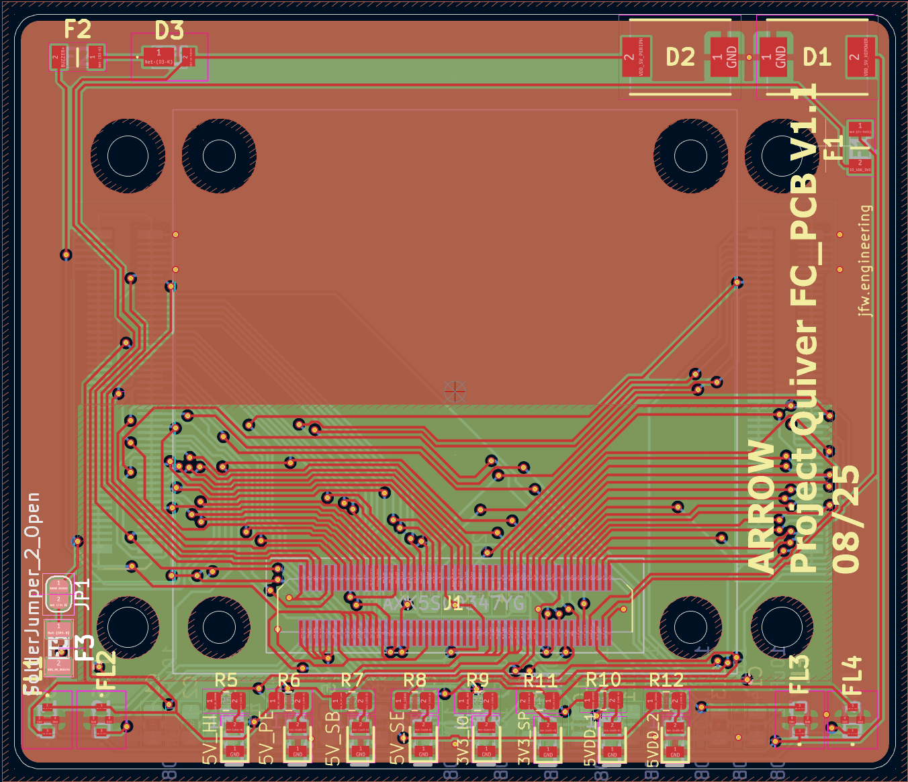
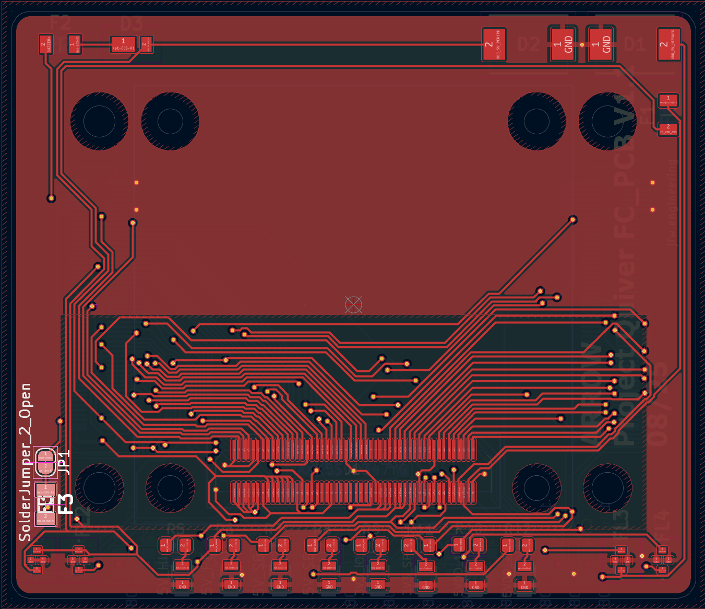
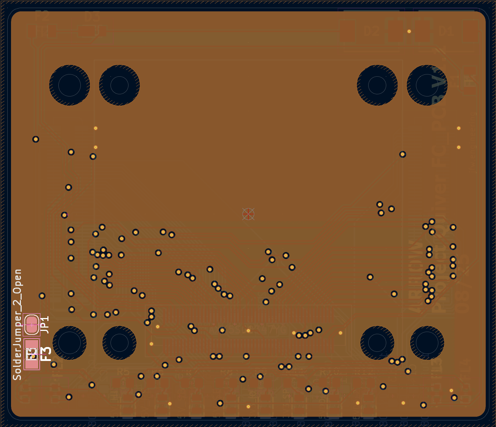
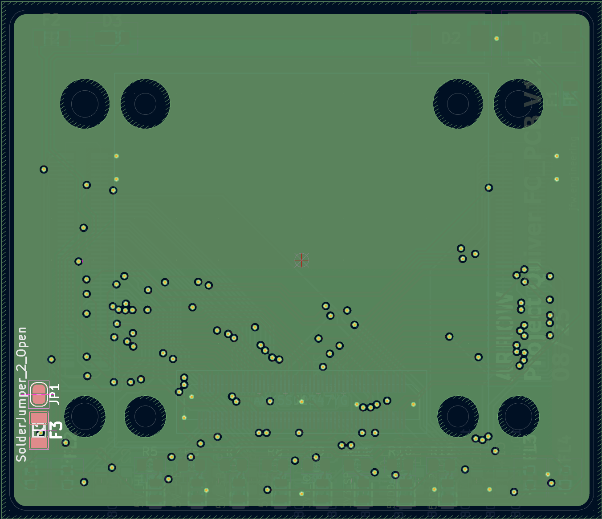
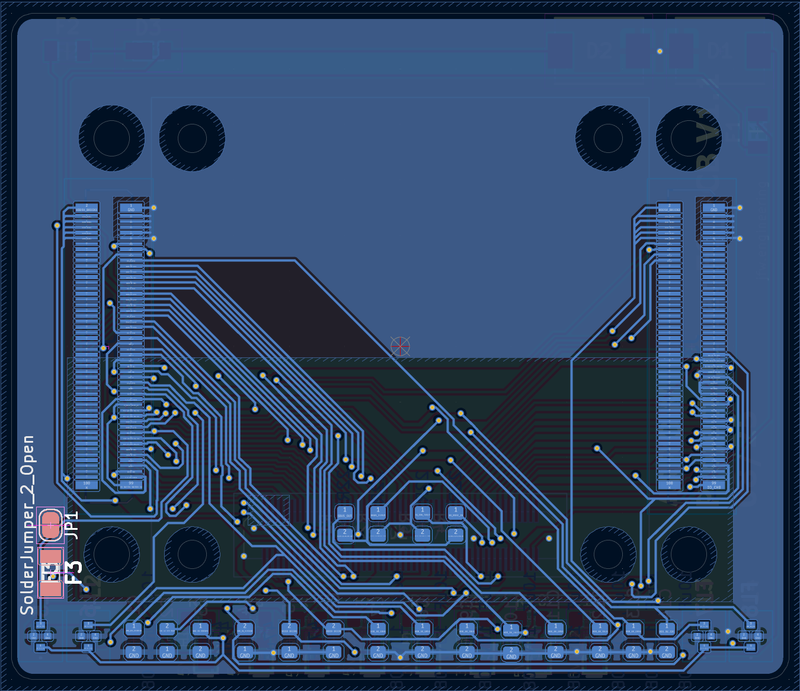

# PT 3 Flight Controller PCB Updates

# Status

`Valid`

`Revision History: V1`

`Replacement Log: None`

`Reference: Updates to PT 3 Flight Controller PCB Information Note`

# Project Description

## PCB Update

The FC PCB was updated to include various changes that were noticed during the build and testing process. Few changes were made to the components or operation of the PCB. Majority of the changes involved changing the size of the screw holes, component placement and routing, and correcting the orientation of the flight controller. This information note will give a detailed breakdown of the updates. 

# Methodology

Updates were collected via the manufacturing, assembly, and testing process of Quiver PT3.

# Results and Deliverables

## Updated Schematics and CAD files

***Previous Schematic with highlighted changes***

***Schematic with additional components highlighted***

|           F.CU                            |                 In1.CU                      |                      In2.CU                 |                    B.CU                   |
|:-------------------------------------:|:-------------------------------------:|:-------------------------------------:|:-------------------------------------:|
| |  |  ||

## PCB Updates

- J2 & J3 replaced header with socket (AXK6S00547YG)
- JP1 & F3
    - shorting VDD5V_BRICK1 & VDD_5V_PERIPH with fuse to prevent boot loop on startup
    - This is optional and added just in case it is needed. This can be removed in a future update.
- Board Updates
    - Pix32 rotated by 180°
    - Pix32 position adjustment to fit screw holes
    - Pix32 screw hole diameter increased for better tolerance
    - Bigger offset around mounting holes to better space components and traces from edges

# Remarks

- Design updated was conducted by Julius.
- Schematic and CAD files can be found in the Quiver PT3 task and bounties directory
- information note prepared by Erick.
