<!--Chinese language comparison included 包含汉语对照-->
# Status 

Valid

# Project Description

In order to realize the functions of Quiver's next phase PT3 plan, it was decided to significantly improve the enclosure of the cockpit area, the mounting method of the GNSS module, attachment interface and the altimeters in the upgrade work from PT2 to PT3:

- Enclosure Assembly: Since the main structure of PT2 is aluminum plate frame, and the enclosures of the power supply and avionics areas have only a limited protection level. Therefore, it was decided to design a new set of enclosures, and at the same time upgrade some of the original enclosures to meet their protection level for critical device areas.
- GNSS Stand: After many discussions, it was decided that the RTK-GNSS module would be installed inside the cockpit, but new installation methods needed to be explored, so the new GNSS stand was designed.
- Attachment Interface: The number of attachment interfaces increased from 1 to 3, and all attachment interfaces were added with extension structures to enhance ergonomics. 
- Altimeter Mounting Frame: An integrated mounting bracket was designed to reintegrate the installation layout of LiDAR and radar altimeter.
- Multiple airframe structural parts: In order to make the above major changes work properly, some of the original airframe parts were modified to ensure installation and wiring.

<!-- 
为了实现Quiver下一阶段的PT3计划中的功能，决定在PT2至PT3的升级工作中，对cockpit区域的外壳、GNSS模块、attachment interface和高度计安装方式进行大幅度改良：

- Enclosure Assembly：由于PT2的主体结构为铝板框架，且电源和航电区域的外壳仅具有有限的防护等级。因此决定设计一套新的外壳，同时对原有的部分外壳进行升级改造，以满足其对关键设备区域的防护性能。
- GNSS Stand：经过多次讨论决定，RTK-GNSS模块将安装在cockpit内部，但需要探索新的安装方式，因此设计了新的GNSS stand。
- Attachment Interface：attachment interface由1个增加为3个，同时所有attachment interface均添加了延伸结构，以强化人机工效。
- Altimeter Mounting Frame：设计了集成安装支架，以重新整合LiDAR和无线电高度计的安装布局。
- Multiple airframe structural parts：为了让以上主要改动正常运作，对部分原有的airframe部件进行了修改，以确保可安装及布线。
-->

# Methodology 

The Fusion 360 software was used for this collaborative design and delivery. All new designs were based on the 3D models of the PT2 airframe, Main PCB, Battery connector PCB designed by Julius and various externally imported parts.

<!--本次协作设计和交付均使用Fusion 360软件，所有的新设计均基于Julius所设计的PT2 airframe、Main PCB、Battery connector PCB和各类外部导入的零部件的3d模型。-->

# Results and Deliverables 

The main results are:
- 3D models of several new parts for 3D printing, some of them requires support structure enabled when printing.
- New modification for some old airframe metal parts need to be drilled or re-ordered.

<!--
主要成果为：
- 多个新部件的3d模型，以供3d打印，部分新零件在打印时需要使用支撑功能。
- 对于部分旧airframe金属部件的新改动，需要钻孔或重新定制。
-->

## Enclosure Assembly

Total|Explode 
:-:|:-:
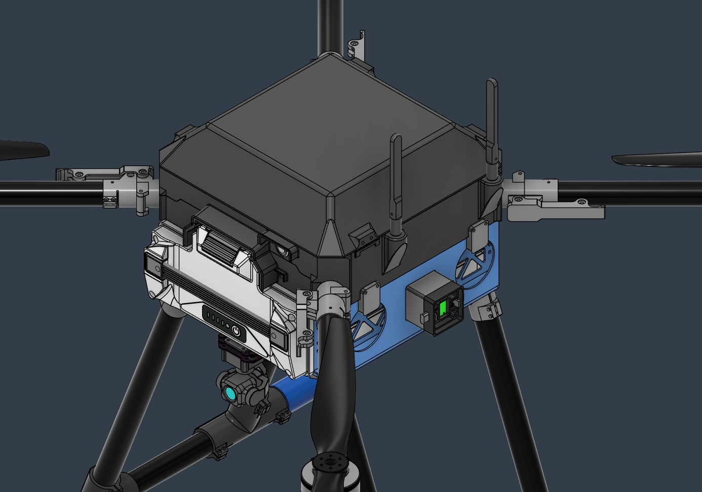|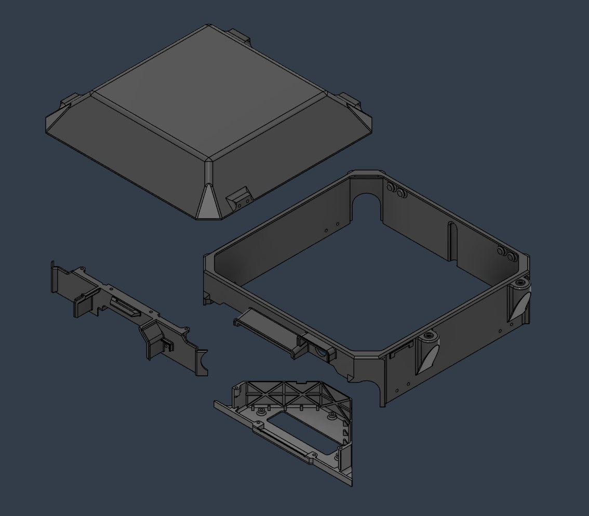

The enclosure uses various designs to prevent rain from splashing, dripping or seeping into the electronic device area. The Enclosure Assembly is divided into 4 parts: Battery PCB enclosure, Main enclosure, Front lid and Top cap.

- The opening part that needs to interact with various electronic devices uses a rain canopy design and a drip-proof design, and the gaps and edges of the enclosure uses a reverse slope design for water-proof.
- A new enclosure is designed for the power connector PCB, which has better heat dissipation and structural support for the PCB, while minimizing the structural weight of the non-stressed part.
- One side of the main enclosure is designed with an RP-SMA connector mounting bracket reserved for the telemetry antenna.
- The top cap continues the hinge operating function of PT2, and the entire shape and volume are redesigned to meet the clearance requirements of the RTK-GNSS receiver in the cockpit.

Please visit the model space for more specific design details.

<!--
外壳使用了各种设计以防止雨水溅入、滴落或渗入电子设备区域。Enclosure Assembly分为4个部分，分别为：Battery PCB enclosure、Main enclosure、Front lid和Top cap。

- 在需要与各类电子设备交互的开口部分使用了雨檐设计和防滴落设计，而外壳的缝隙和边缘采用了具有反坡坡度的防渗水设计。
- 为power connector PCB设计了新的外壳，具有现有更好的散热和对PCB的结构支撑作用，同时尽量减轻了非受力部分的结构重量。
- main enclosure的一侧设有为telemetry天线预留的RP-SMA连接器安装支架。
- top cap则延续了PT2的铰链操作的功能，并重新设计了整个外形和体积，以满足机身内RTK-GNSS接收机的净空需求。

请访问model space以查看更多设计细节。

-->

## GNSS Stand

Total|Explode 
:-:|:-:
 | 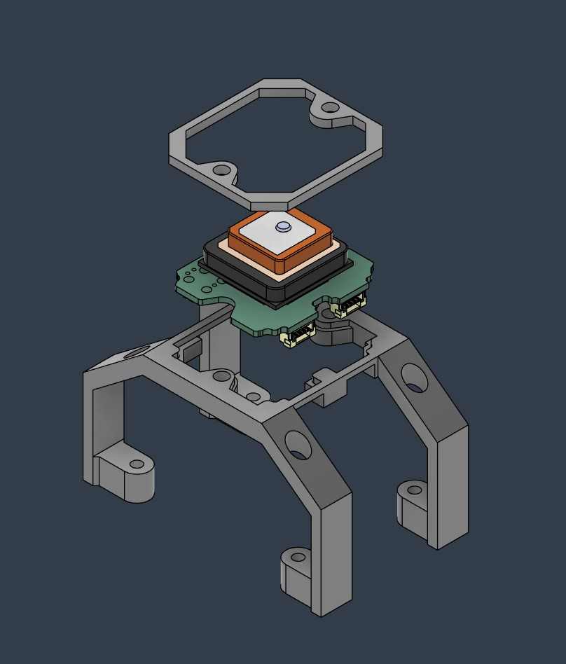

- The GNSS receiver is placed about 2 cm above the FCU enclosure to reduce EMI interference. A new arch-type bracket is specially designed for this layout, which enables the GNSS module to be stably supported without direct contact with the FCU and its PCB.
- The GNSS stand is divided into the bracket and the fastening frame. The bracket is the main structure, and the fastening frame is used to clamp the GNSS receiver's PCB with the main structure.

<!--
- GNSS接收机被置于FCU enclosure上方约2厘米的位置以降低EMI干扰，为此布局专门设计了一个新的拱门式支架，得以使GNSS模块在不直接接触FCU和其PCB的条件下达成稳定支撑。
- GNSS stand分为支架和紧固框架，支架为主体结构，紧固框架用于将GNSS接收机的PCB夹在主体结构上。
-->

## Attachment Interface

Lower|Side Explode 
:-:|:-:
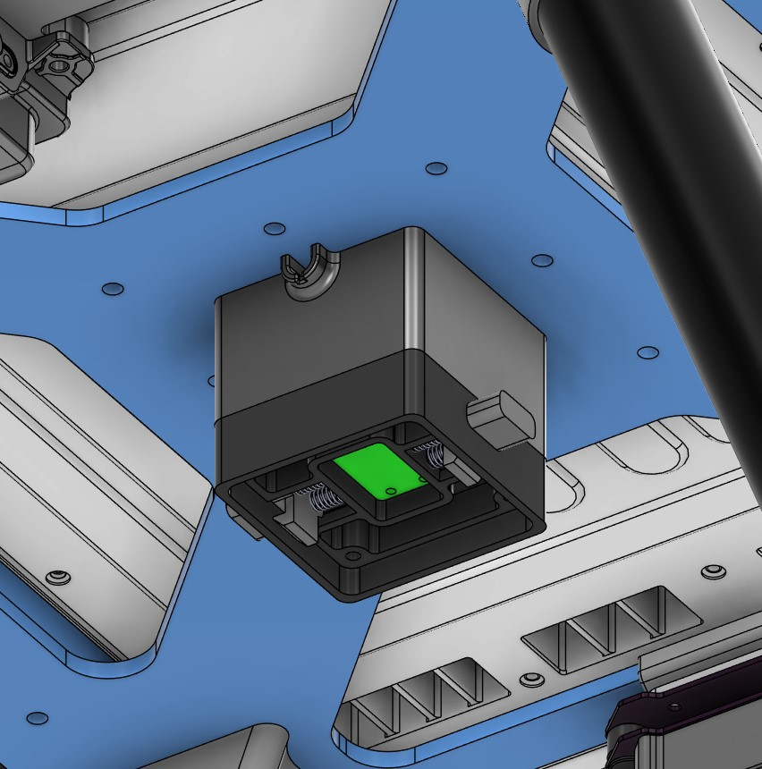 | 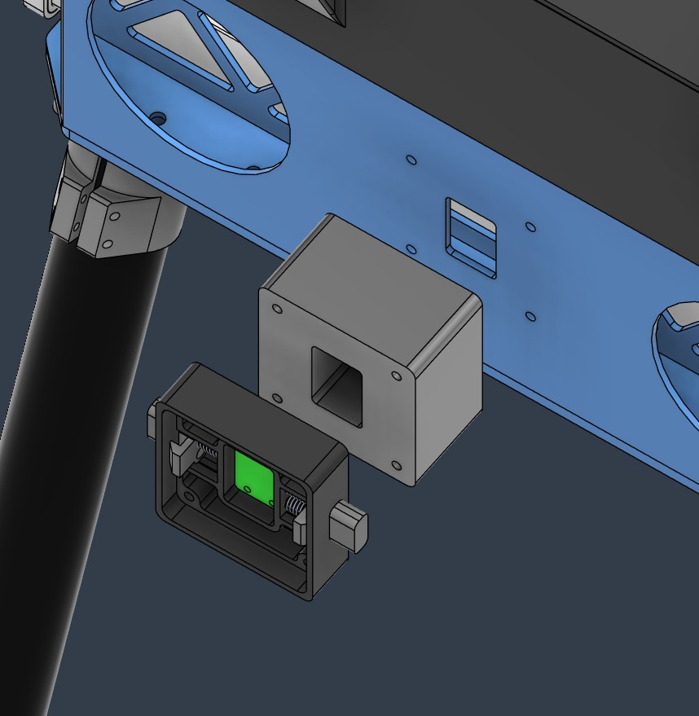

- New attachment interface is added on each side of the airframe. At the same time, the vertical plate is modified to close the central lightening hole and added screw holes and cable openings required for the attachment interface in its original position.
- A side-facing cable opening is designed on the extension structure of the bottom attachment interface, and the opening is designed to prevent scratching the cable, also prevent rain from penetrating along the cable.
- Considering the convenience of disassembly and replacement of mission equipment, all attachment interfaces are now installed on a new designed extender with an extension length of 3cm to increase the clearance between them and the fuselage.

<!--
- 在airframe两侧各新增了一个attachment interface。同时对vertical plate进行了改动，闭合了中央的减轻孔，并在其原有位置上增加了attachment interface所需的螺丝孔位和线缆开口。
- 在底部attachment interface的延伸结构上设计了侧向的线缆开口，且开口处具有防刮蹭线缆和防雨水沿线缆渗入的设计。
- 考虑到便于任务设备的拆装和更换，所有attachment interface现在均安装在新设计的延伸支架上，延伸长度为3cm，以增加其与机身之间的净空距。
-->

## Altimeter Mounting Frame

Total|Explode 
:-:|:-:
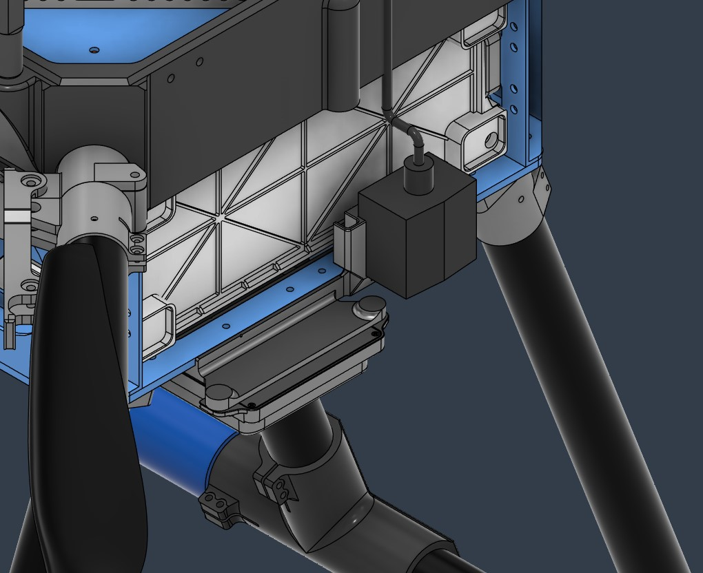 | 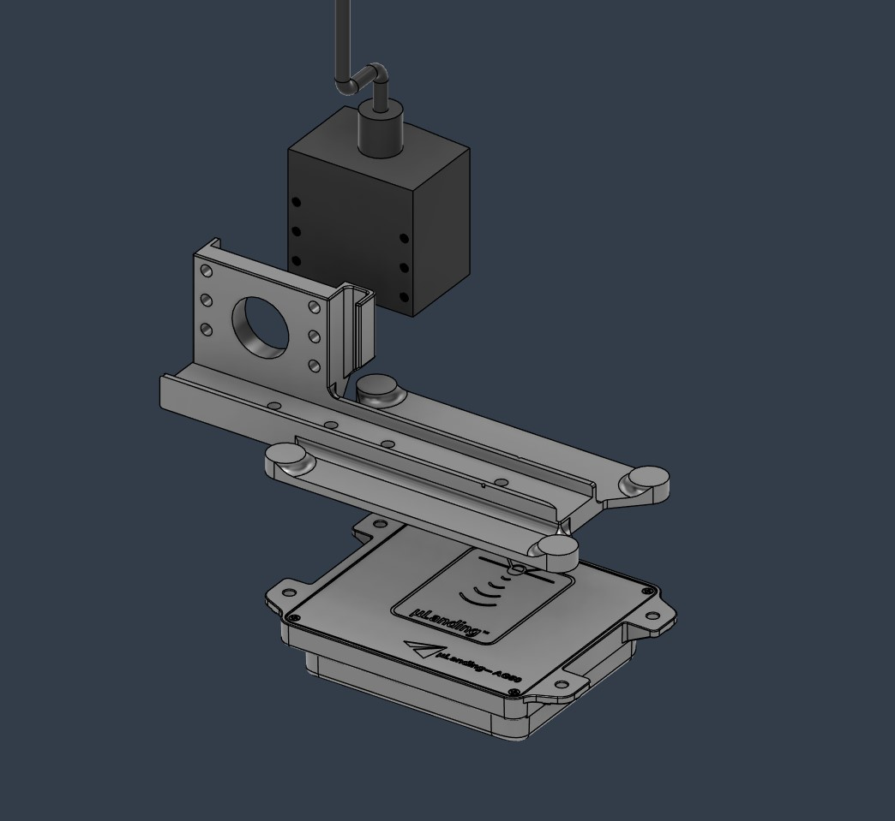

After referencing and adjusting the 3D models of the two altimeters, the new altimeter mounting frame was designed based on their new positions.

- The altimeter mounting frame includes a cable management slot that can limit the cable position of the altimeter and the bottom attachment interface to a certain extent to prevent the cables from moving and blocking the LiDAR altimeter.
- The new altimeter mounting frame requires a new hole to be drilled on the attachment plate to complete the installation.

<!--
在引用并调整了两个高度计的3d模型并调整了位置后，基于其新位置设计了新的高度计安装支架。

- 高度计支架包含了一个理线槽，可在一定程度上限制高度计和底部attachment interface的线缆位置，以防止线缆移动并阻挡LiDAR高度计。
- 新的高度计支架需要在attachment plate上钻出一新的孔位以完成安装。
-->

## Battery Wall Modifications

Battery Wall
:-:
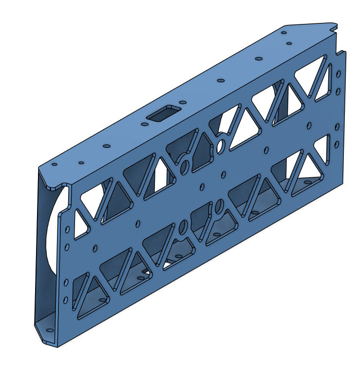

Three modifications on the battery walls were applied:

- 4 holes on each side for attachment interface installation. The holes are sized based on M3 screw heads so that the screws can be placed through the holes and tightened with a screwdriver.
- Motor arm connector lower screws were installed through chamfered holes between middle plate and battery walls previously, making them hard to replace. The screw holes were extended through the battery walls and cutouts were created for tightening the screws with an allen key.
- Harness cutouts are created on the top and bottom surfaces for routing cables between layers. 

## Battery Slider Modification

Battery Slider
:-:
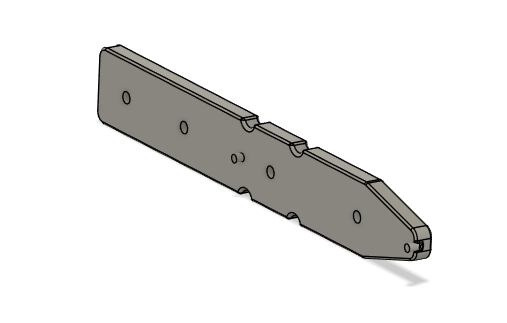

Dents aligned with side attachment interface installation holes were created on the slider for the screws and a screwdriver. One battery slider - battery wall installation hole was shifted so that it can be reached through the attachment interface hole.

## Harness Cutouts on the Plates

Plates
:-:
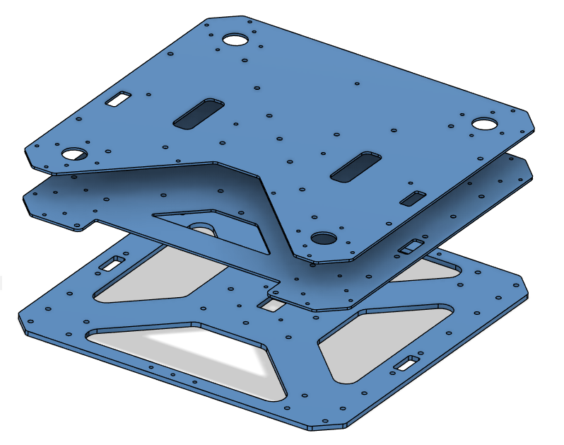

Cutouts were created on the plates for routing cables between layers.

## Main PCB Mount

Without PCB | With PCB
:-:|:-:
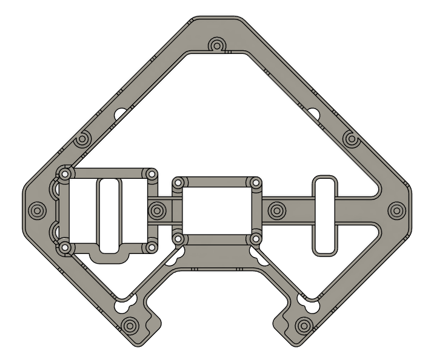 | 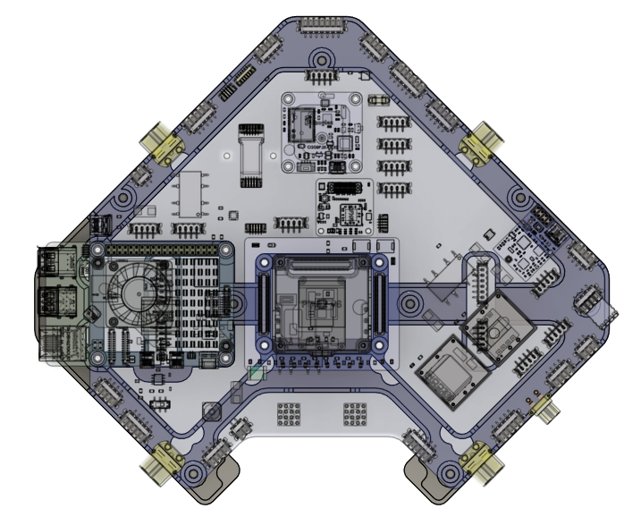

Main PCB holder was modified so that the holes are aligned with PCB installation holes. Additional anchors were created for the flight controller and Raspberry Pi.

## Cockpit Support Beams

Cockpit Support Beams
:-:
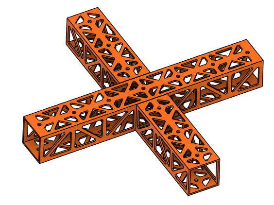

Cutouts on the cockpit support beams are created for weight reduction of 200 g.

# Remarks 
