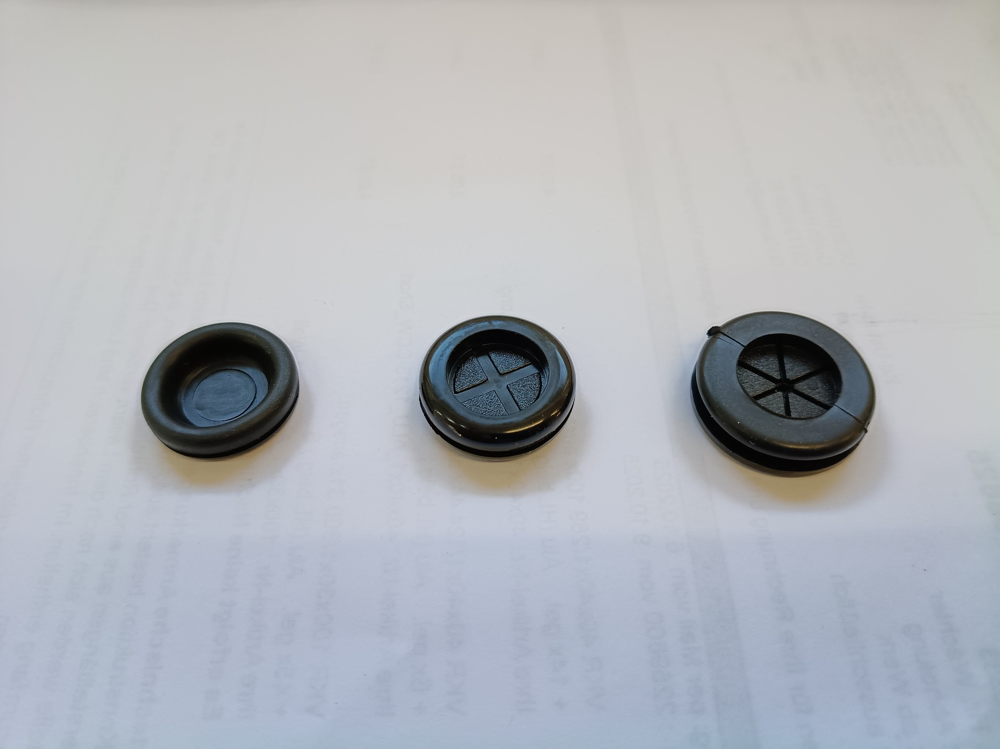
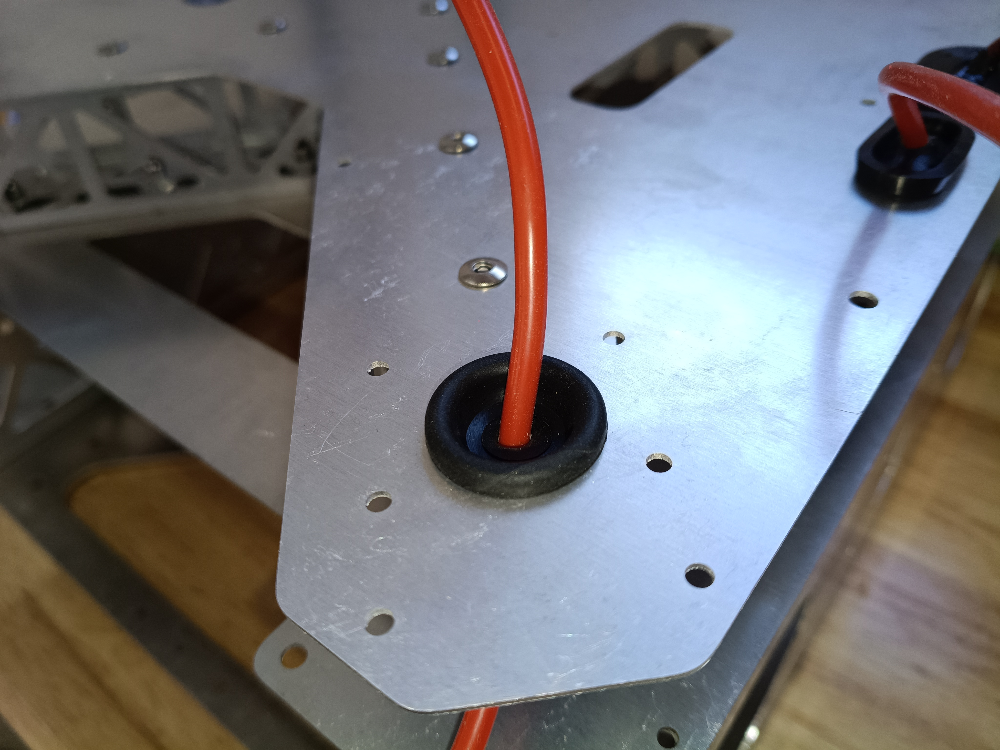
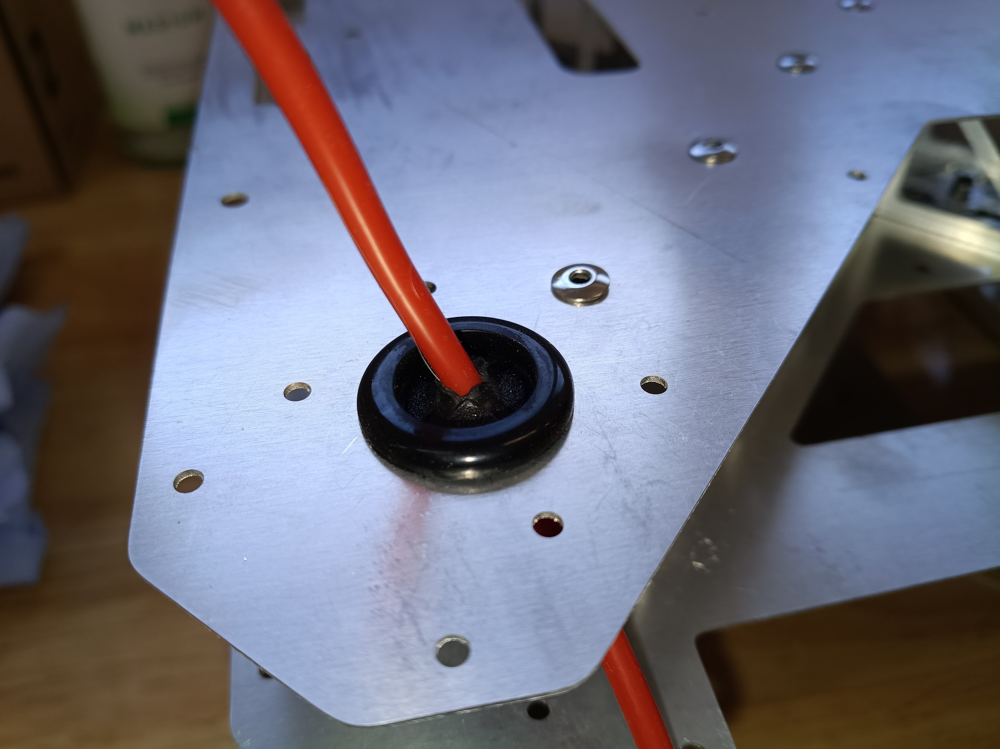
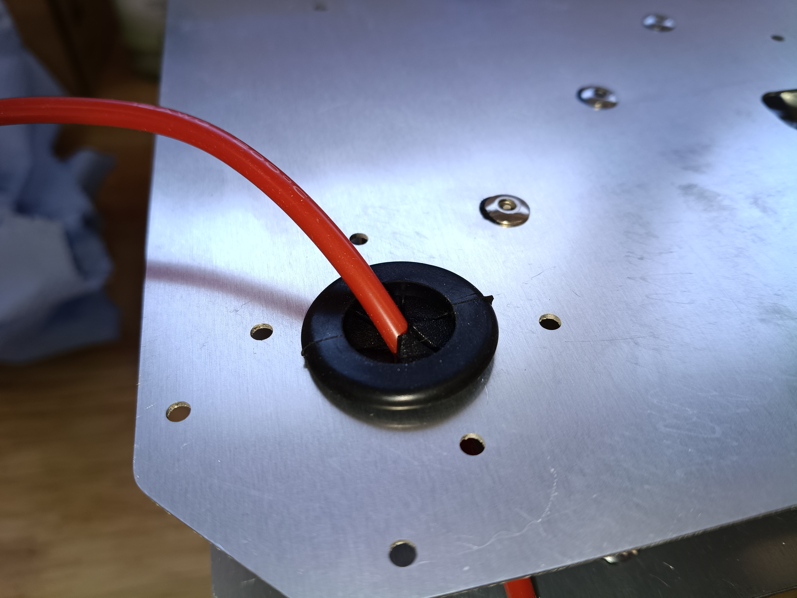
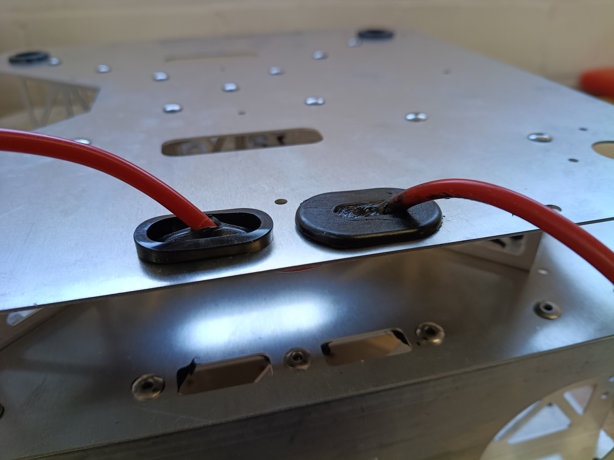
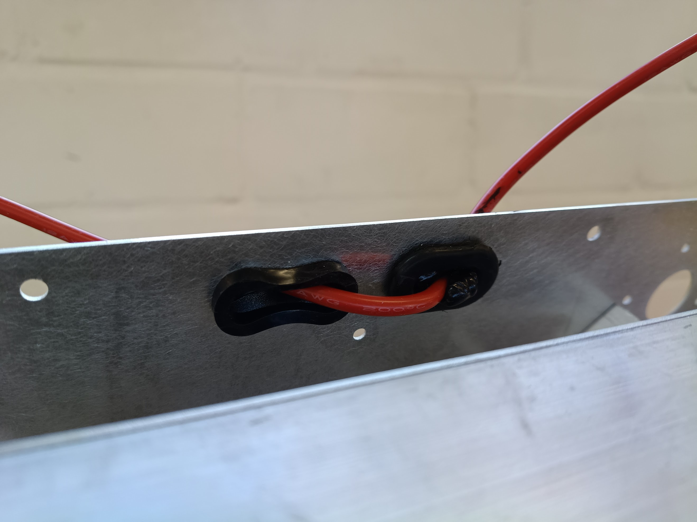

# Status 

`Valid`

`Revision History: V1.0`

`Replacement Log: None`

`Reference:-`

# Project Description

To better protect the Quiver PT3 housing against dust and water, several options are listed and tested here. The ultimate goal is complete water protection so that the drone can fly during rain.

# Methodology 

First, several rubber cable grommets are tested and silicone is applied to specific areas of the housing. This is followed by an initial test of the improvements.

# Results and Deliverables 

Goal: Improved dust and water protection.

## Main areas of the housing that can let in dust and water

1. Area between the lid and the middle housing
2. Round holes for the ESC cables
3. Rectangle holes that go into the battery wall
4. Plate and enclosure gap
5. Front side cable entrance
6. Battery connector PCB compartment gap

## 3 Options tested for the 20mm ESC cable holes (#2)
All three together:

 1:
 
 2:
 
 3.
 
 
Comment: All 3 will work, I prefer the one that has the lowest hardness (#1)
## 2 Options tested for the rectangular holes (#3)
Both versions together (#1 left, #2 right):

Comment: Both not a perfect fit. I recommend using #1 and making minor adjustments to the rectangular holes in the next version. 
Comment 2: The part with the silicone was just a test. It is a bit messy.

# Remarks 

- Work in progress

(End of document)
